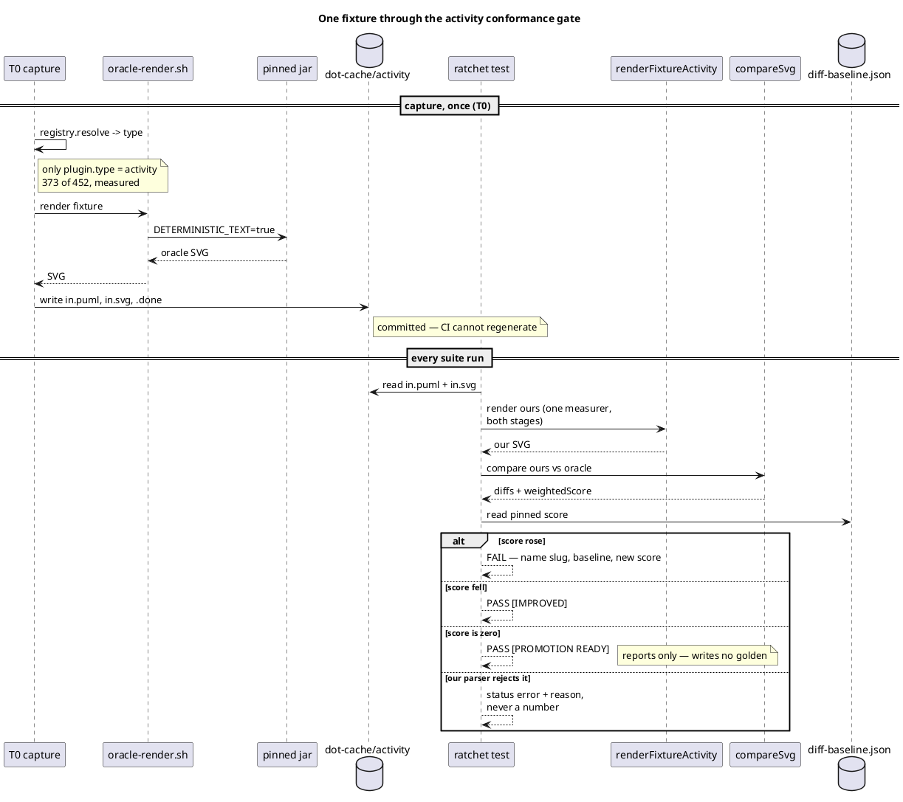

# Data flow — how the gate measures a fixture

Who calls whom, in order, for one fixture. The measurement is pure and
synchronous; the only external process is the pinned jar, and it runs at
capture time (T0), never inside the suite.

## The ordering that makes the fix provable

T2 pins the pre-chrome floor; T5 changes the renderer; T6 re-pins. Pinning
after the fix would make the descent unmeasurable, and a re-pin that raises
a score without a stated mechanism is an adopted regression — which has
happened in this repo before.
