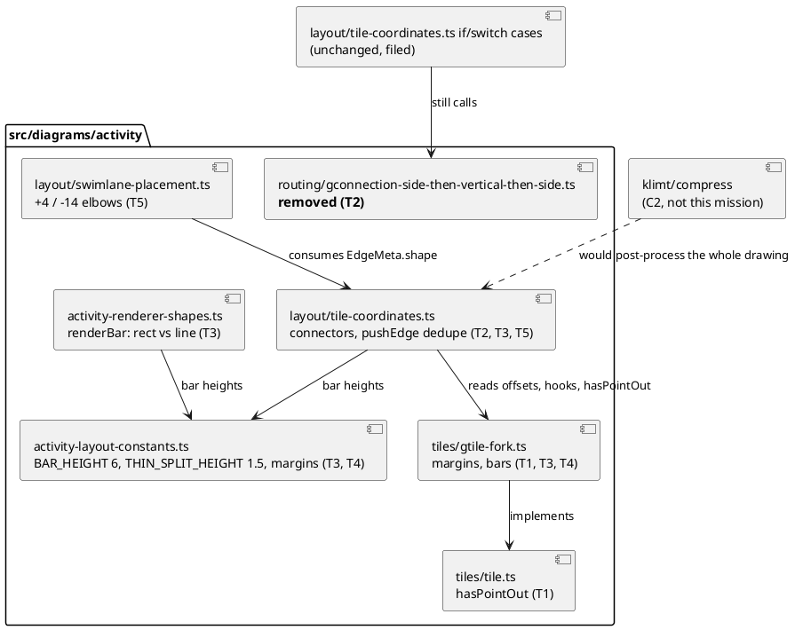

# Component map — write-sets

Which modules each task touches and what each consumes. The routing helper
stays for if/switch; `klimt/compress` is outside the mission (C2).

```plantuml
@startuml
package "src/diagrams/activity" {
  component [tiles/tile.ts\nhasPointOut (T1)] as tile
  component [tiles/gtile-fork.ts\nmargins, bars (T1, T3, T4)] as fork
  component [layout/tile-coordinates.ts\nconnectors, pushEdge dedupe (T2, T3, T5)] as tc
  component [routing/gconnection-side-then-vertical-then-side.ts\n=== removed (T2)] as gc
  component [layout/swimlane-placement.ts\n+4 / -14 elbows (T5)] as sp
  component [activity-layout-constants.ts\nBAR_HEIGHT 6, THIN_SPLIT_HEIGHT 1.5, margins (T3, T4)] as consts
  component [activity-renderer-shapes.ts\nrenderBar: rect vs line (T3)] as rs
}
component [layout/tile-coordinates.ts if/switch cases\n(unchanged, filed)] as ifsw
component [klimt/compress\n(C2, not this mission)] as c2

fork --> tile : implements
tc --> fork : reads offsets, hooks, hasPointOut
tc --> consts : bar heights
ifsw --> gc : still calls
sp --> tc : consumes EdgeMeta.shape
rs --> consts : bar heights
c2 ..> tc : would post-process the whole drawing
@enduml
```
