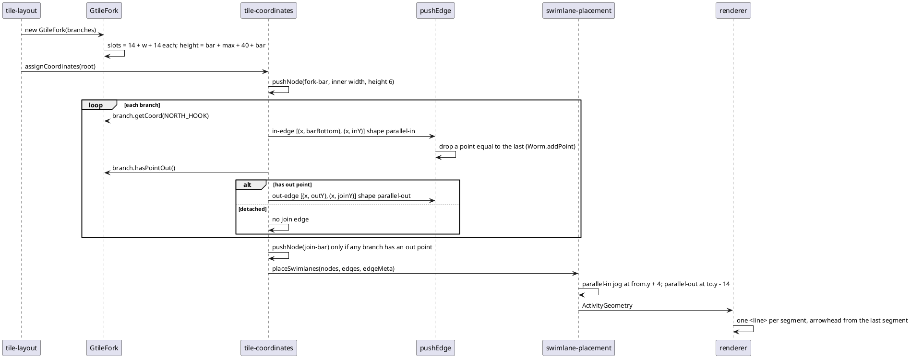

# Data flow — the fork coordinate pass after this mission

Who calls whom, in order, for one fork with two branches (one detached).
`hasPointOut` (T1) gates the join edge; the connectors (T2) are vertical
drops at the branch x; the bars (T3) are sized from the inner width; the
margins (T4) come from computeNewFtile; the lane pass (T5) jogs only the
cross-lane parallel edges.

