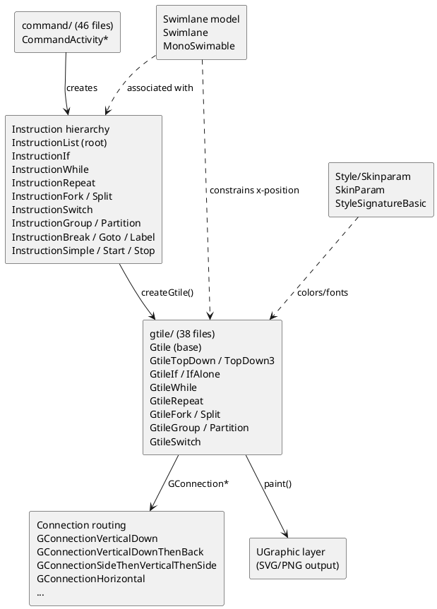
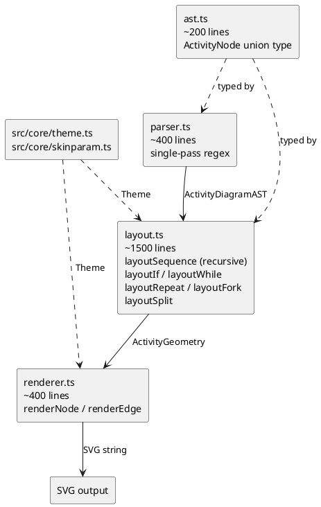
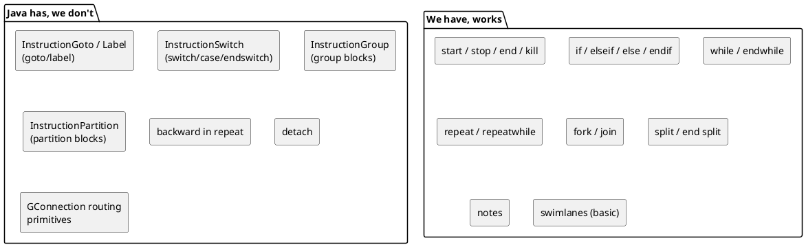

# Component Map

## Java Activity Diagram v3 Architecture

```plantuml
@startuml
skinparam componentStyle rectangle
skinparam shadowing false

[command/ (46 files)\nCommandActivity*] as CMD
[Instruction hierarchy\nInstructionList (root)\nInstructionIf\nInstructionWhile\nInstructionRepeat\nInstructionFork / Split\nInstructionSwitch\nInstructionGroup / Partition\nInstructionBreak / Goto / Label\nInstructionSimple / Start / Stop] as INST
[gtile/ (38 files)\nGtile (base)\nGtileTopDown / TopDown3\nGtileIf / IfAlone\nGtileWhile\nGtileRepeat\nGtileFork / Split\nGtileGroup / Partition\nGtileSwitch] as GTILE
[Connection routing\nGConnectionVerticalDown\nGConnectionVerticalDownThenBack\nGConnectionSideThenVerticalThenSide\nGConnectionHorizontal\n...] as CONN
[UGraphic layer\n(SVG/PNG output)] as UG
[Swimlane model\nSwimlane\nMonoSwimable] as SWIM
[Style/Skinparam\nSkinParam\nStyleSignatureBasic] as SKIN

CMD --> INST : creates
INST --> GTILE : createGtile()
GTILE --> CONN : GConnection*
GTILE --> UG : paint()
SWIM ..> INST : associated with
SWIM ..> GTILE : constrains x-position
SKIN ..> GTILE : colors/fonts
@enduml
```

## Our Current TypeScript Architecture

```plantuml
@startuml
skinparam componentStyle rectangle
skinparam shadowing false

[parser.ts\n~400 lines\nsingle-pass regex] as P
[layout.ts\n~1500 lines\nlayoutSequence (recursive)\nlayoutIf / layoutWhile\nlayoutRepeat / layoutFork\nlayoutSplit] as L
[renderer.ts\n~400 lines\nrenderNode / renderEdge] as R
[SVG output] as OUT
[ast.ts\n~200 lines\nActivityNode union type] as AST
[src/core/theme.ts\nsrc/core/skinparam.ts] as THEME

P --> L : ActivityDiagramAST
L --> R : ActivityGeometry
R --> OUT : SVG string
AST ..> P : typed by
AST ..> L : typed by
THEME ..> L : Theme
THEME ..> R : Theme
@enduml
```

## Gap at a Glance

```plantuml
@startuml
skinparam componentStyle rectangle
skinparam shadowing false

package "Java has, we don't" {
  [InstructionGoto / Label\n(goto/label)] as G1
  [InstructionSwitch\n(switch/case/endswitch)] as G2
  [InstructionGroup\n(group blocks)] as G3
  [InstructionPartition\n(partition blocks)] as G4
  [backward in repeat] as G5
  [detach] as G6
  [GConnection routing\nprimitives] as G7
}

package "We have, works" {
  [start / stop / end / kill] as W1
  [if / elseif / else / endif] as W2
  [while / endwhile] as W3
  [repeat / repeatwhile] as W4
  [fork / join] as W5
  [split / end split] as W6
  [notes] as W7
  [swimlanes (basic)] as W8
}

@enduml
```
