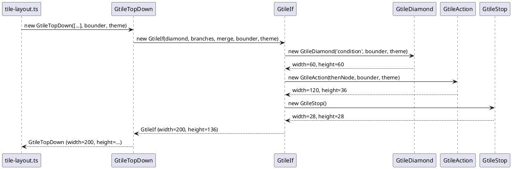
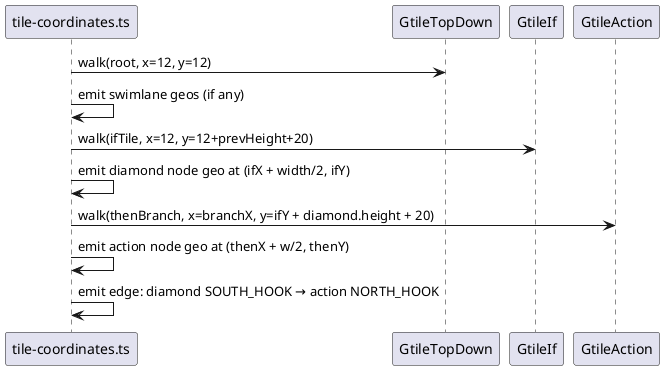

# Data Flow — Tile Layout Pipeline

## Full pipeline sequence

```plantuml
@startuml
participant Caller
participant "tile-layout.ts" as tile-layout
participant "tileNode dispatcher" as tileNode
participant "tiles/gtile-*.ts" as Tiles
participant "tile-coordinates.ts" as coords
participant "routing/gconnection-*.ts" as GConn
participant "renderer.ts" as renderer
Caller -> tile-layout : layoutActivity(ast, theme, measurer)
tile-layout -> tile-layout : adapt measurer → StringBounder
tile-layout -> tileNode : tileNodes(ast.nodes, bounder, theme)
loop for each AST node
  tileNode -> Tiles : new GtileXxx(node, bounder, theme)
  Tiles --> tileNode : Tile (width, height, getCoord)
end
tileNode --> tile-layout : root Tile (GtileTopDown)
tile-layout -> coords : assignCoordinates(root, ast, baseX, baseY, bounder, theme)
coords -> coords : recursive tile walk → canvas (x,y) per tile
loop for each connection between tiles
  coords -> GConn : getPoints(fromHook, toHook)
  GConn --> coords : GPoint[] waypoints
  coords -> coords : emit ActivityEdgeGeo
end
coords -> coords : compute totalWidth, totalHeight
coords --> tile-layout : ActivityGeometry
tile-layout --> Caller : ActivityGeometry
Caller -> renderer : renderActivity(geo, theme)
renderer --> Caller : SVG string
@enduml
```

## Tile construction (Phase: build tile tree)



## Coordinate assignment (Phase: canvas coords)


