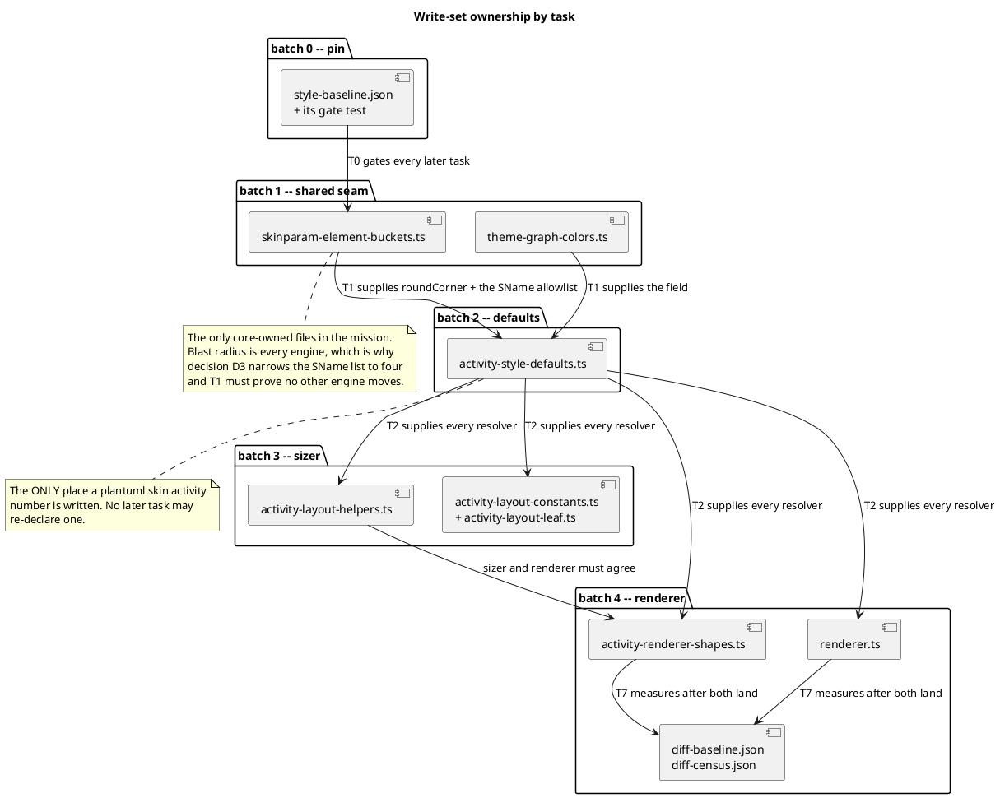

# Component map — write-set by batch

Each task owns its files exclusively; no file is written by two tasks in
the same batch.

```plantuml
@startuml
title Write-set ownership by task

package "batch 0 -- pin" {
  component StyleBaseline as "style-baseline.json\n+ its gate test"
}

package "batch 1 -- shared seam" {
  component Buckets as "skinparam-element-buckets.ts"
  component GraphColors as "theme-graph-colors.ts"
}

package "batch 2 -- defaults" {
  component Defaults as "activity-style-defaults.ts"
}

package "batch 3 -- sizer" {
  component Helpers as "activity-layout-helpers.ts"
  component Constants as "activity-layout-constants.ts\n+ activity-layout-leaf.ts"
}

package "batch 4 -- renderer" {
  component Shapes as "activity-renderer-shapes.ts"
  component Renderer as "renderer.ts"
  component Repin as "diff-baseline.json\ndiff-census.json"
}

StyleBaseline --> Buckets : T0 gates every later task
Buckets --> Defaults : T1 supplies roundCorner + the SName allowlist
GraphColors --> Defaults : T1 supplies the field
Defaults --> Helpers : T2 supplies every resolver
Defaults --> Constants : T2 supplies every resolver
Defaults --> Shapes : T2 supplies every resolver
Defaults --> Renderer : T2 supplies every resolver
Helpers --> Shapes : sizer and renderer must agree
Shapes --> Repin : T7 measures after both land
Renderer --> Repin : T7 measures after both land

note bottom of Buckets
  The only core-owned files in the mission.
  Blast radius is every engine, which is why
  decision D3 narrows the SName list to four
  and T1 must prove no other engine moves.
end note

note bottom of Defaults
  The ONLY place a plantuml.skin activity
  number is written. No later task may
  re-declare one.
end note
@enduml
```
