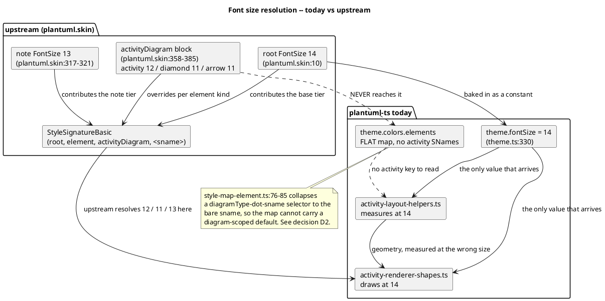
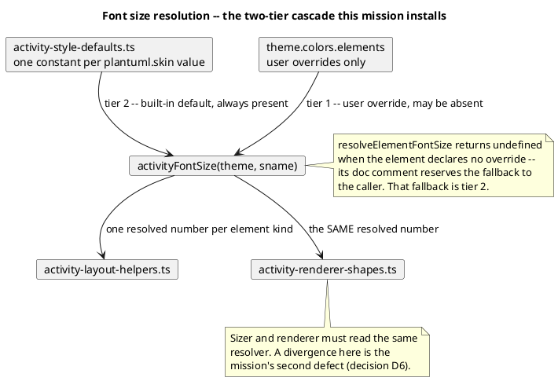

# Data flow — where the per-element size is lost

Today the activity engine takes one number, the diagram-wide root font
size, and applies it to every element. Upstream resolves a distinct value
per element kind from a diagram-scoped style signature.

## After this mission

