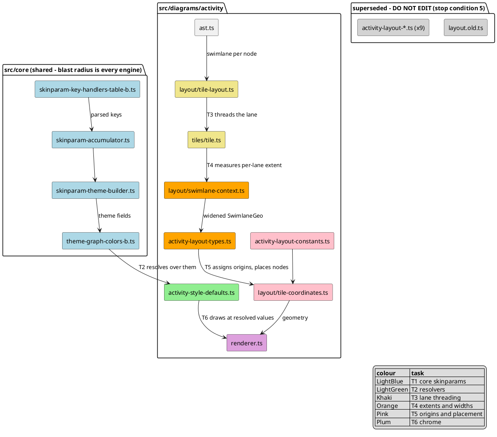

# Write-set map

Colour marks the owning task. Read-only context is uncoloured.

```plantuml
@startuml
skinparam componentStyle rectangle

package "src/core (shared - blast radius is every engine)" {
  component "skinparam-key-handlers-table-b.ts" as KH #LightBlue
  component "skinparam-accumulator.ts" as ACC #LightBlue
  component "skinparam-theme-builder.ts" as TB #LightBlue
  component "theme-graph-colors-b.ts" as TGC #LightBlue
}

package "src/diagrams/activity" {
  component "activity-style-defaults.ts" as SD #LightGreen
  component "tiles/tile.ts" as TILE #Khaki
  component "layout/tile-layout.ts" as TL #Khaki
  component "layout/swimlane-context.ts" as SC #Orange
  component "activity-layout-types.ts" as TYPES #Orange
  component "layout/tile-coordinates.ts" as TC #Pink
  component "activity-layout-constants.ts" as CONST #Pink
  component "renderer.ts" as R #Plum
  component "ast.ts" as AST
}

package "superseded - DO NOT EDIT (stop condition 5)" {
  component "layout.old.ts" as OLD #LightGray
  component "activity-layout-*.ts (x9)" as OLDS #LightGray
}

KH --> ACC : parsed keys
ACC --> TB
TB --> TGC : theme fields
TGC --> SD : T2 resolves over them
AST --> TL : swimlane per node
TL --> TILE : T3 threads the lane
TILE --> SC : T4 measures per-lane extent
SC --> TYPES : widened SwimlaneGeo
TYPES --> TC : T5 assigns origins, places nodes
CONST --> TC
SD --> R : T6 draws at resolved values
TC --> R : geometry

legend right
  |= colour |= task |
  | LightBlue | T1 core skinparams |
  | LightGreen | T2 resolvers |
  | Khaki | T3 lane threading |
  | Orange | T4 extents and widths |
  | Pink | T5 origins and placement |
  | Plum | T6 chrome |
endlegend
@enduml
```
