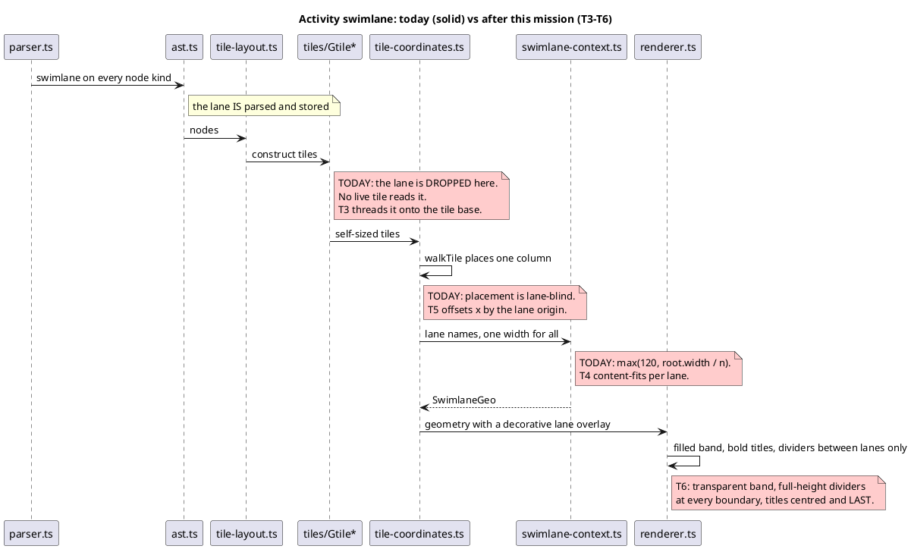
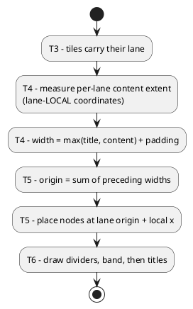

# Where the lane is lost

The lane survives parsing and then falls out of the pipeline. Each task
below is marked with where it re-attaches it.

## The ordering constraint

[D1]'s two phases exist because of a dependency, not a preference: a lane's
origin is the running sum of the widths before it, so no node can be placed
until every width is known.

