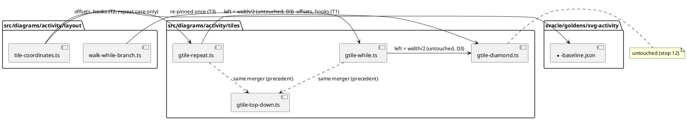

# Write-set map

```plantuml
@startuml
package "src/diagrams/activity/tiles" {
  [gtile-while.ts] as GW
  [gtile-repeat.ts] as GR
  [gtile-top-down.ts] as GTD
  [gtile-diamond.ts] as GD
}
package "src/diagrams/activity/layout" {
  [walk-while-branch.ts] as WW
  [tile-coordinates.ts] as TC
}
package "oracle/goldens/svg-activity" {
  [*-baseline.json] as PINS
}
WW -> GW : offsets, hooks (T1)
TC -> GR : offsets, hooks (T2, repeat case only)
GW ..> GTD : same merger (precedent)
GR ..> GTD : same merger (precedent)
GW -> GD : left = width/2 (untouched, D3)
GR -> GD : left = width/2 (untouched, D3)
TC -> PINS : re-pinned once (T3)
note right of GD : untouched (stop 12)
@enduml
```
