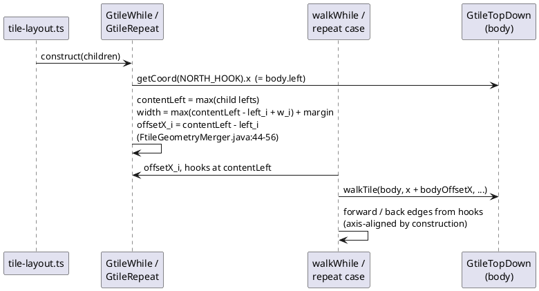

# Where a loop child's x is decided

```plantuml
@startuml
participant "tile-layout.ts" as TL
participant "GtileWhile /\nGtileRepeat" as TILE
participant "walkWhile /\nrepeat case" as WALK
participant "GtileTopDown\n(body)" as BODY

TL -> TILE : construct(children)
TILE -> BODY : getCoord(NORTH_HOOK).x  (= body.left)
TILE -> TILE : contentLeft = max(child lefts)\nwidth = max(contentLeft - left_i + w_i) + margin\noffsetX_i = contentLeft - left_i\n(FtileGeometryMerger.java:44-56)
WALK -> TILE : offsetX_i, hooks at contentLeft
WALK -> BODY : walkTile(body, x + bodyOffsetX, ...)
WALK -> WALK : forward / back edges from hooks\n(axis-aligned by construction)
@enduml
```
