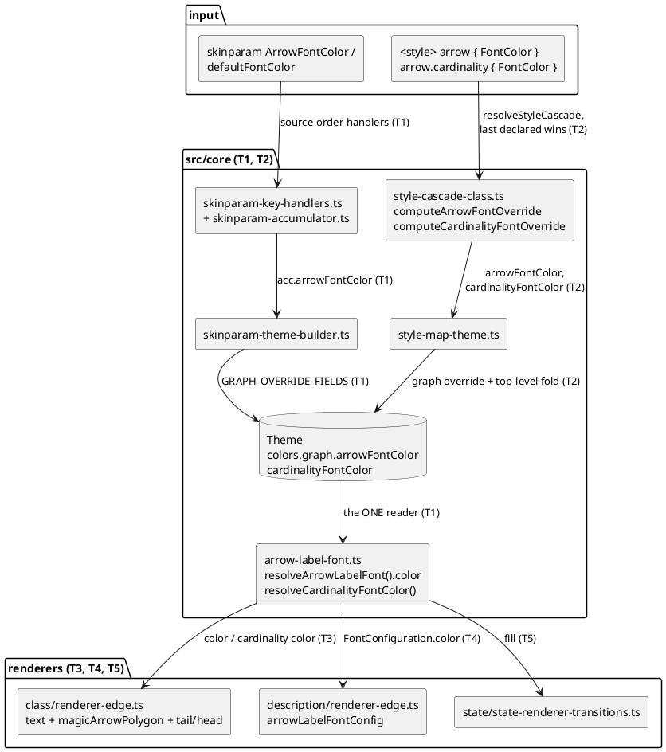

# Component map — arrow-label-font-colour

Which modules carry the arrow FontColor from source to ink, and which task
touches each. Solid = exists today (SI24 D3 built the font path); the
mission adds the `color`/`cardinalityFontColor` slots along the same edges.

