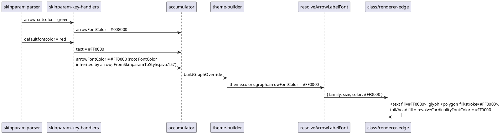

# Data flow — one class edge, `skinparam ArrowFontColor green` then `defaultFontColor red`

Oracle experiment b (`decisions.md`): the LATER `defaultFontColor` wins.
The sequence shows why the port needs no ordering logic — handlers run in
source order and each assignment overwrites (D4).

