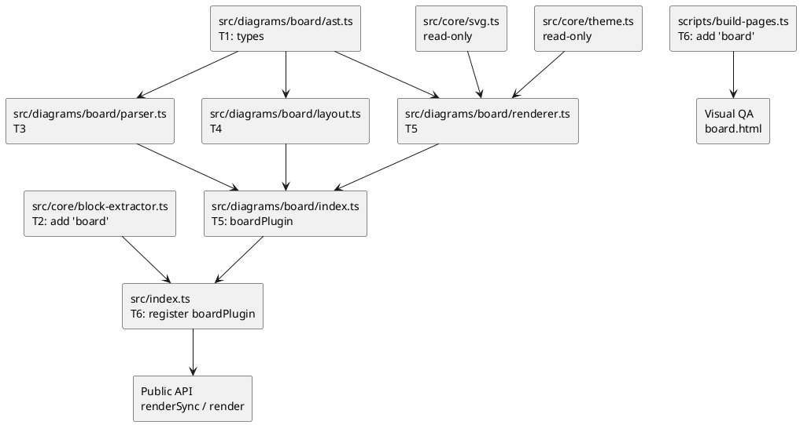
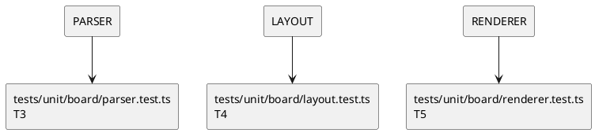

# Component Map

```plantuml
@startuml
skinparam componentStyle rectangle
skinparam shadowing false

[src/core/block-extractor.ts\nT2: add 'board'] as BE
[src/index.ts\nT6: register boardPlugin] as IDX
[src/diagrams/board/ast.ts\nT1: types] as AST
[src/diagrams/board/parser.ts\nT3] as PARSER
[src/diagrams/board/layout.ts\nT4] as LAYOUT
[src/diagrams/board/renderer.ts\nT5] as RENDERER
[src/diagrams/board/index.ts\nT5: boardPlugin] as PLUGIN
[src/core/svg.ts\nread-only] as SVG
[src/core/theme.ts\nread-only] as THEME
[Public API\nrenderSync / render] as API
[scripts/build-pages.ts\nT6: add 'board'] as PAGES
[Visual QA\nboard.html] as VQA

BE --> IDX
AST --> PARSER
AST --> LAYOUT
AST --> RENDERER
PARSER --> PLUGIN
LAYOUT --> PLUGIN
RENDERER --> PLUGIN
PLUGIN --> IDX
SVG --> RENDERER
THEME --> RENDERER
IDX --> API
PAGES --> VQA
@enduml
```

## Test coverage

```plantuml
@startuml
skinparam componentStyle rectangle
skinparam shadowing false

[PARSER] as PARSER
[tests/unit/board/parser.test.ts\nT3] as PT
[LAYOUT] as LAYOUT
[tests/unit/board/layout.test.ts\nT4] as LT
[RENDERER] as RENDERER
[tests/unit/board/renderer.test.ts\nT5] as RT

PARSER --> PT
LAYOUT --> LT
RENDERER --> RT
@enduml
```
