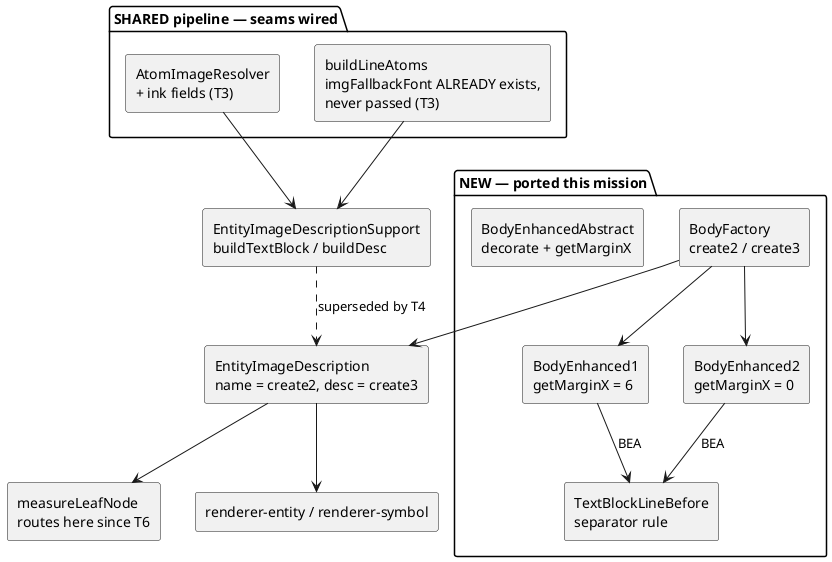

# Component map — what this mission adds and rewires

## Reading it

- `EntityImageDescription` is the convergence point. Because the SIZER has
  routed through `calculateDimensionSlow` since T6, wiring `BodyFactory`
  there serves BOTH paths — that is ADR-1, and it is why there is no
  sizer-only shim.
- The dotted edge is what T4 supersedes: our local `buildTextBlock`/
  `buildDesc` stop being the builder.
- `buildLineAtoms` is drawn as a seam that EXISTS and is never passed —
  ADR-3. The fix is threading, not new API.
- `getMarginX` 6 vs 0 is the entire folder/package story: `name` goes
  through `create2`, `desc` through `create3`.
