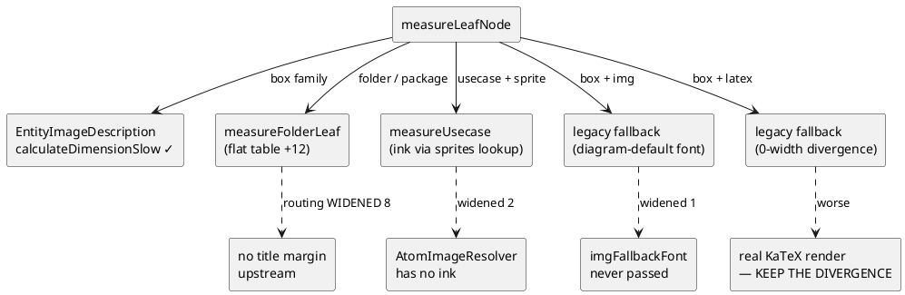
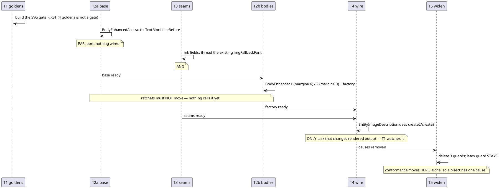
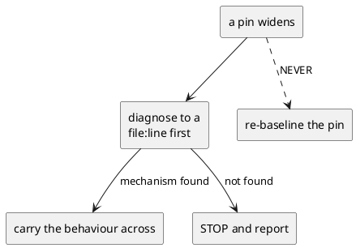

# Data flow — why the routing is stuck, and how this frees it

## 1. Where T6 stopped

```plantuml
@startuml
skinparam componentStyle rectangle
skinparam shadowing false

[measureLeafNode] as A
[EntityImageDescription\ncalculateDimensionSlow ✓] as B
[measureFolderLeaf\n(flat table +12)] as C
[measureUsecase\n(ink via sprites lookup)] as D
[legacy fallback\n(diagram-default font)] as E
[legacy fallback\n(0-width divergence)] as F
[no title margin\nupstream] as X
[AtomImageResolver\nhas no ink] as Y
[imgFallbackFont\nnever passed] as Z
[real KaTeX render\n— KEEP THE DIVERGENCE] as W

A --> B : box family
A --> C : folder / package
A --> D : usecase + sprite
A --> E : box + img
A --> F : box + latex
C ..> X : routing WIDENED 8
D ..> Y : widened 2
E ..> Z : widened 1
F ..> W : worse
@enduml
```

## 2. What each batch removes

```plantuml
@startuml
' NOTE: mermaid grouping flattened -- alt/opt/loop/group render the whole
' diagram EMPTY in plantuml-ts today (.agent-notes/plantuml-sequence-group-empty.md).
' Original nesting: par port, nothing wired ; and
participant "T1 goldens" as T1
participant "T2a base" as T2a
participant "T3 seams" as T3
participant "T2b bodies" as T2b
participant "T4 wire" as T4
participant "T5 widen" as T5
T1 -> T1 : build the SVG gate FIRST (4 goldens is not a gate)
T2a -> T2a : BodyEnhancedAbstract + TextBlockLineBefore
note over T2a : PAR: port, nothing wired
T3 -> T3 : ink fields; thread the existing imgFallbackFont
note over T3 : AND
T2a -> T2b : base ready
T2b -> T2b : BodyEnhanced1 (marginX 6) / 2 (marginX 0) + factory
note over T2a,T2b : ratchets must NOT move — nothing calls it yet
T2b -> T4 : factory ready
T3 -> T4 : seams ready
T4 -> T4 : EntityImageDescription uses create2/create3
note over T4 : ONLY task that changes rendered output — T1 watches it
T4 -> T5 : causes removed
T5 -> T5 : delete 3 guards; latex guard STAYS
note over T5 : conformance moves HERE, alone, so a bisect has one cause
@enduml
```

## 3. The rule that governs every batch

```plantuml
@startuml
skinparam componentStyle rectangle
skinparam shadowing false

[a pin widens] as A
[diagnose to a\nfile:line first] as B
[carry the behaviour across] as C
[STOP and report] as D
[re-baseline the pin] as E

A --> B
B --> C : mechanism found
B --> D : not found
A ..> E : NEVER
@enduml
```
