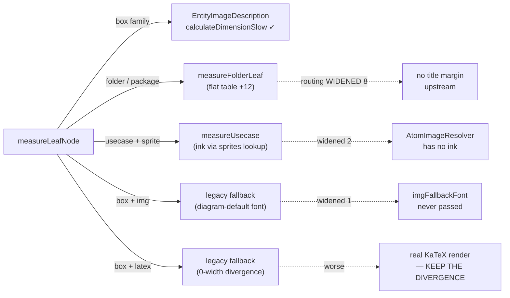
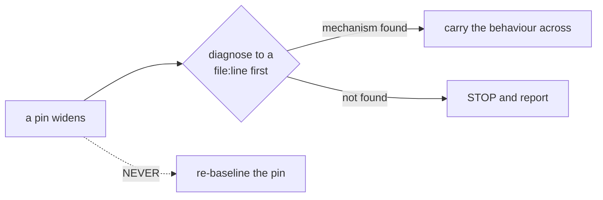

# Data flow — why the routing is stuck, and how this frees it

## 1. Where T6 stopped



## 2. What each batch removes

```mermaid
sequenceDiagram
    participant T1 as T1 goldens
    participant T2a as T2a base
    participant T3 as T3 seams
    participant T2b as T2b bodies
    participant T4 as T4 wire
    participant T5 as T5 widen

    T1->>T1: build the SVG gate FIRST (4 goldens is not a gate)
    par port, nothing wired
        T2a->>T2a: BodyEnhancedAbstract + TextBlockLineBefore
    and
        T3->>T3: ink fields; thread the existing imgFallbackFont
    end
    T2a->>T2b: base ready
    T2b->>T2b: BodyEnhanced1 (marginX 6) / 2 (marginX 0) + factory
    Note over T2a,T2b: ratchets must NOT move — nothing calls it yet
    T2b->>T4: factory ready
    T3->>T4: seams ready
    T4->>T4: EntityImageDescription uses create2/create3
    Note over T4: ONLY task that changes rendered output — T1 watches it
    T4->>T5: causes removed
    T5->>T5: delete 3 guards; latex guard STAYS
    Note over T5: conformance moves HERE, alone, so a bisect has one cause
```

## 3. The rule that governs every batch


