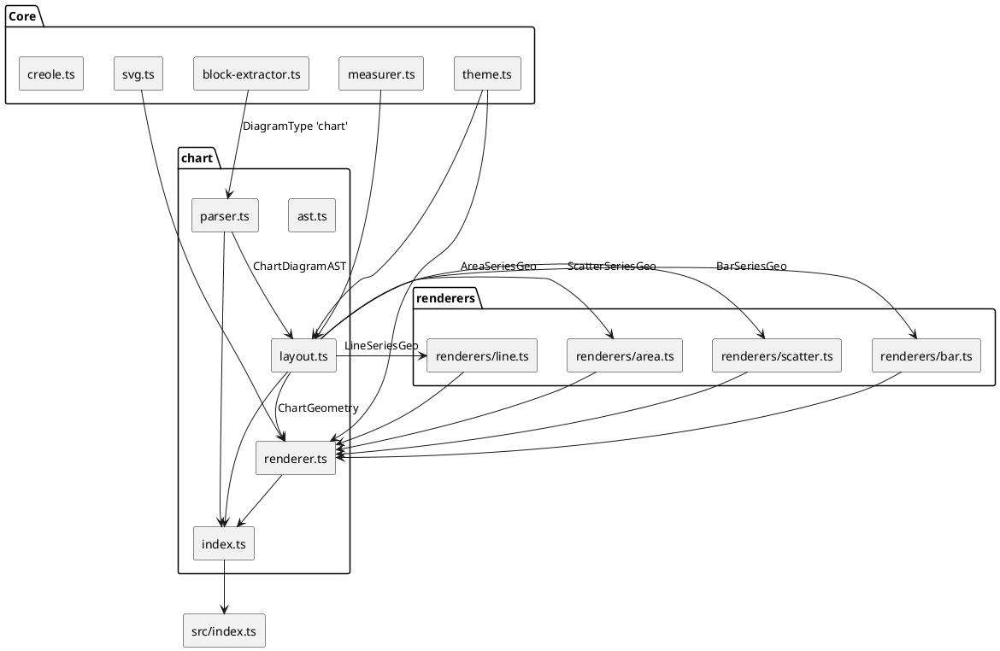

```plantuml
@startuml
skinparam componentStyle rectangle
skinparam shadowing false

package "Core" {
  [block-extractor.ts] as BE
  [svg.ts] as SVG
  [theme.ts] as THEME
  [measurer.ts] as MEAS
  [creole.ts] as CREOLE
}

package "chart" {
  [ast.ts] as AST
  [parser.ts] as PARSER
  [layout.ts] as LAYOUT
  [renderer.ts] as RENDER
  [index.ts] as INDEX
}

package "renderers" {
  [renderers/bar.ts] as BAR
  [renderers/line.ts] as LINE
  [renderers/area.ts] as AREA
  [renderers/scatter.ts] as SCAT
}

[src/index.ts] as IDX

BE --> PARSER : DiagramType 'chart'
PARSER --> LAYOUT : ChartDiagramAST
LAYOUT --> RENDER : ChartGeometry
LAYOUT --> BAR : BarSeriesGeo
LAYOUT --> LINE : LineSeriesGeo
LAYOUT --> AREA : AreaSeriesGeo
LAYOUT --> SCAT : ScatterSeriesGeo
BAR --> RENDER
LINE --> RENDER
AREA --> RENDER
SCAT --> RENDER
SVG --> RENDER
THEME --> LAYOUT
THEME --> RENDER
MEAS --> LAYOUT
INDEX --> IDX
PARSER --> INDEX
LAYOUT --> INDEX
RENDER --> INDEX
@enduml
```
