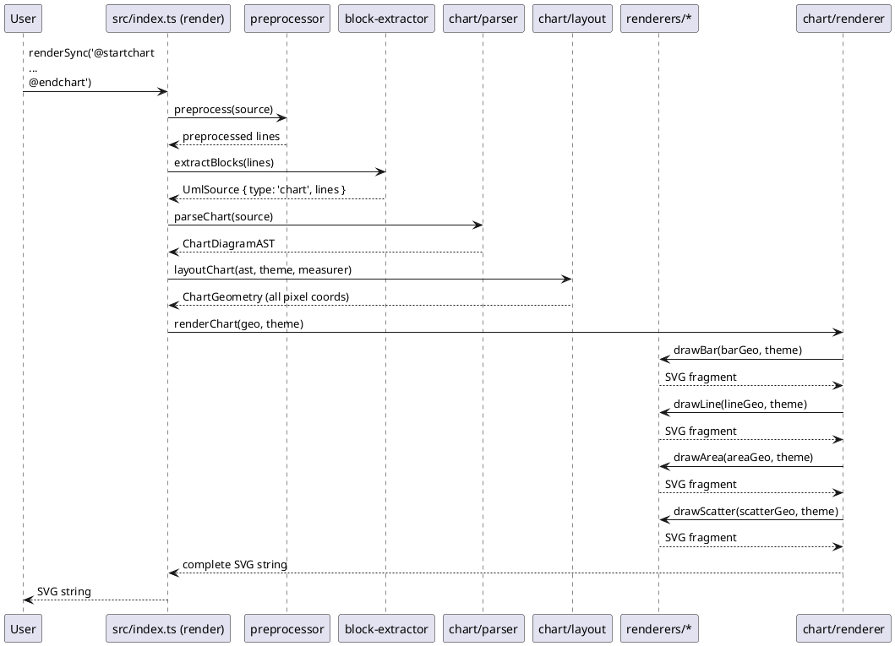

```plantuml
@startuml
participant User
participant "src/index.ts (render)" as API
participant "preprocessor" as Pre
participant "block-extractor" as BE
participant "chart/parser" as Parser
participant "chart/layout" as Layout
participant "renderers/*" as Sub
participant "chart/renderer" as Orch
User -> API : renderSync('@startchart\n...\n@endchart')
API -> Pre : preprocess(source)
Pre --> API : preprocessed lines
API -> BE : extractBlocks(lines)
BE --> API : UmlSource { type: 'chart', lines }
API -> Parser : parseChart(source)
Parser --> API : ChartDiagramAST
API -> Layout : layoutChart(ast, theme, measurer)
Layout --> API : ChartGeometry (all pixel coords)
API -> Orch : renderChart(geo, theme)
Orch -> Sub : drawBar(barGeo, theme)
Sub --> Orch : SVG fragment
Orch -> Sub : drawLine(lineGeo, theme)
Sub --> Orch : SVG fragment
Orch -> Sub : drawArea(areaGeo, theme)
Sub --> Orch : SVG fragment
Orch -> Sub : drawScatter(scatterGeo, theme)
Sub --> Orch : SVG fragment
Orch --> API : complete SVG string
API --> User : SVG string
@enduml
```
