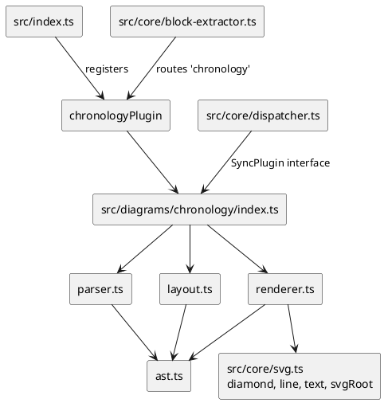

# Component Map



```plantuml
@startuml
skinparam componentStyle rectangle
skinparam shadowing false

[@startchronology source] as SRC
[parseChronology] as P
[ChronologyDiagramAST\nevents: ChronologyEvent\{\}] as AST
[layoutChronology] as L
[ChronologyGeometry\nevents x/labelAbove\ndayTicks x/label\ndimensions] as GEO
[renderChronology] as R
[SVG string] as SVG

SRC --> P
P --> AST
AST --> L
L --> GEO
GEO --> R
R --> SVG
@enduml
```
