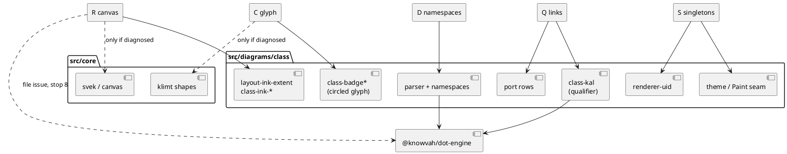

# Component map — what each group is expected to touch

Provisional (T6 fixes the real write-sets). Arrows point from a group to
the components its diagnosis is most likely to land in.

```plantuml
@startuml
package "src/diagrams/class" {
  component "parser + namespaces" as parser
  component "renderer-uid" as uid
  component "class-kal\n(qualifier)" as kal
  component "port rows" as ports
  component "class-badge*\n(circled glyph)" as badge
  component "layout-ink-extent\nclass-ink-*" as ink
  component "theme / Paint seam" as paint
}
package "src/core" {
  component "klimt shapes" as klimt
  component "svek / canvas" as svek
}
component "@knowvah/dot-engine" as dot

rectangle "D namespaces" as gD
rectangle "S singletons" as gS
rectangle "Q links" as gQ
rectangle "C glyph" as gC
rectangle "R canvas" as gR

gD --> parser
gS --> uid
gS --> paint
gQ --> kal
gQ --> ports
gC --> badge
gC ..> klimt : only if diagnosed
gR --> ink
gR ..> svek : only if diagnosed
gR ..> dot : file issue, stop 8
kal --> dot
parser --> dot
@enduml
```
