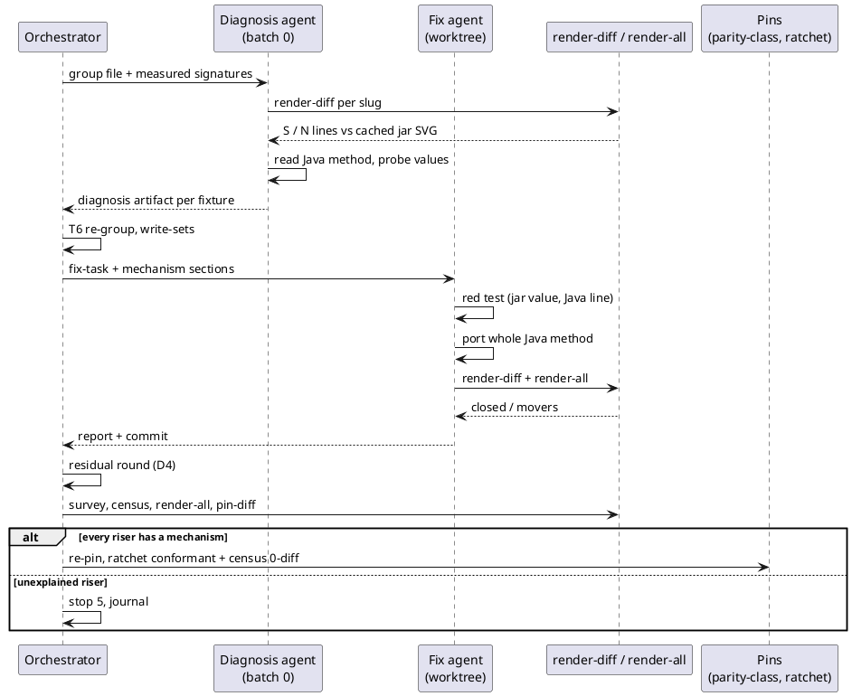

# Data flow — one batch, diagnosis to pin

How a fixture moves from a diff signature to a pin. Rendered and checked
through `renderSync` at planning time.

```plantuml
@startuml
participant "Orchestrator" as O
participant "Diagnosis agent\n(batch 0)" as D
participant "Fix agent\n(worktree)" as F
participant "render-diff / render-all" as R
participant "Pins\n(parity-class, ratchet)" as P

O -> D : group file + measured signatures
D -> R : render-diff per slug
R --> D : S / N lines vs cached jar SVG
D -> D : read Java method, probe values
D --> O : diagnosis artifact per fixture
O -> O : T6 re-group, write-sets
O -> F : fix-task + mechanism sections
F -> F : red test (jar value, Java line)
F -> F : port whole Java method
F -> R : render-diff + render-all
R --> F : closed / movers
F --> O : report + commit
O -> O : residual round (D4)
O -> R : survey, census, render-all, pin-diff
alt every riser has a mechanism
  O -> P : re-pin, ratchet conformant + census 0-diff
else unexplained riser
  O -> O : stop 5, journal
end
@enduml
```
