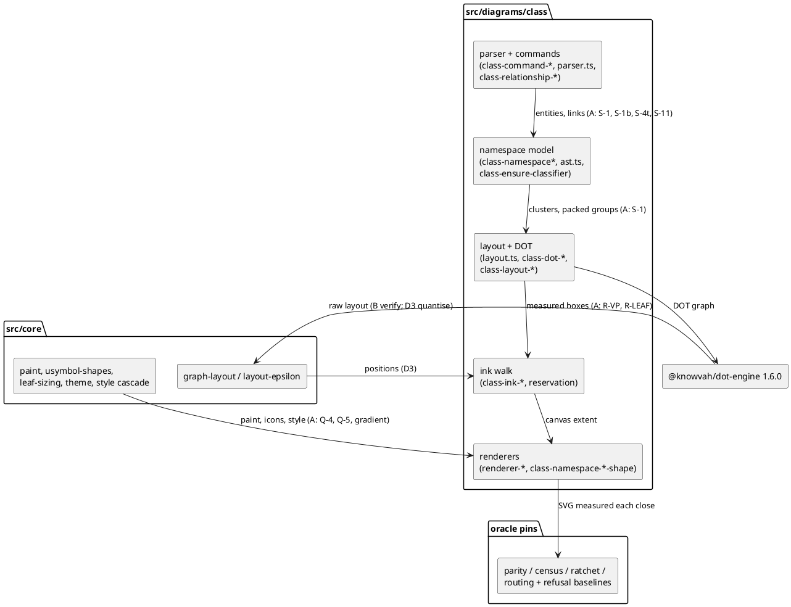

# Component map — what `class-divergence-drive-3` touches

Workstreams (A–E) map onto the class pipeline stages; the dot-engine box is
verified only (D2), never edited here.

```plantuml
@startuml
skinparam componentStyle rectangle
package "src/diagrams/class" {
  [parser + commands\n(class-command-*, parser.ts,\nclass-relationship-*)] as P
  [namespace model\n(class-namespace*, ast.ts,\nclass-ensure-classifier)] as N
  [layout + DOT\n(layout.ts, class-dot-*,\nclass-layout-*)] as L
  [ink walk\n(class-ink-*, reservation)] as I
  [renderers\n(renderer-*, class-namespace-*-shape)] as R
}
package "src/core" {
  [graph-layout / layout-epsilon] as G
  [paint, usymbol-shapes,\nleaf-sizing, theme, style cascade] as C
}
[@knowvah/dot-engine 1.6.0] as D
package "oracle pins" {
  [parity / census / ratchet /\nrouting + refusal baselines] as O
}
P --> N : entities, links (A: S-1, S-1b, S-4t, S-11)
N --> L : clusters, packed groups (A: S-1)
L --> D : DOT graph
D --> G : raw layout (B verify; D3 quantise)
G --> I : positions (D3)
L --> I : measured boxes (A: R-VP, R-LEAF)
I --> R : canvas extent
C --> R : paint, icons, style (A: Q-4, Q-5, gradient)
R --> O : SVG measured each close
@enduml
```
