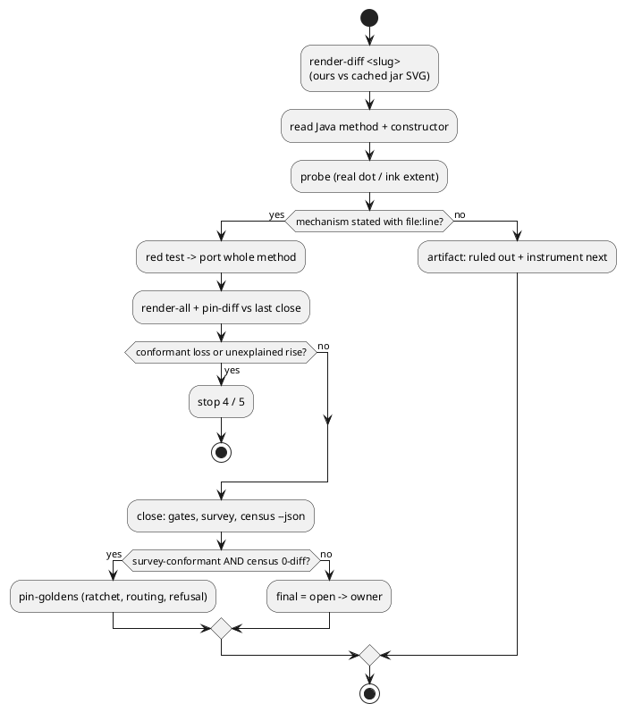

# Data flow — one batch, from fixture to pin

How a fixture moves from non-conformant to pinned; every arrow is a
command in `close-procedure.md` or `fix-task.md`.

```plantuml
@startuml
start
:render-diff <slug>\n(ours vs cached jar SVG);
:read Java method + constructor;
:probe (real dot / ink extent);
if (mechanism stated with file:line?) then (yes)
  :red test -> port whole method;
  :render-all + pin-diff vs last close;
  if (conformant loss or unexplained rise?) then (yes)
    :stop 4 / 5;
    stop
  else (no)
  endif
  :close: gates, survey, census --json;
  if (survey-conformant AND census 0-diff?) then (yes)
    :pin-goldens (ratchet, routing, refusal);
  else (no)
    :final = open -> owner;
  endif
else (no)
  :artifact: ruled out + instrument next;
endif
stop
@enduml
```
