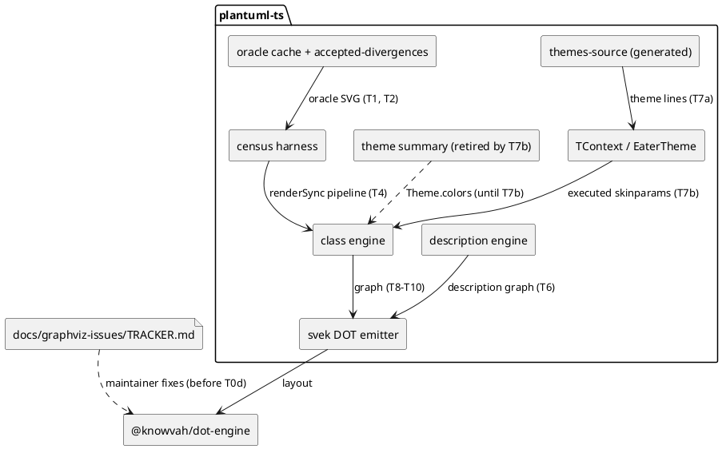

# Component map — cdd4

```plantuml
@startuml
skinparam componentStyle rectangle
package "plantuml-ts" {
  [TContext / EaterTheme] as TIM
  [themes-source (generated)] as TS
  [theme summary (retired by T7b)] as SUM
  [class engine] as CLASS
  [description engine] as DESC
  [svek DOT emitter] as SVEK
  [census harness] as CEN
  [oracle cache + accepted-divergences] as ORA
}
[@knowvah/dot-engine] as DE
file "docs/graphviz-issues/TRACKER.md" as TR
TS --> TIM : theme lines (T7a)
SUM ..> CLASS : Theme.colors (until T7b)
TIM --> CLASS : executed skinparams (T7b)
CLASS --> SVEK : graph (T8-T10)
DESC --> SVEK : description graph (T6)
SVEK --> DE : layout
TR ..> DE : maintainer fixes (before T0d)
CEN --> CLASS : renderSync pipeline (T4)
ORA --> CEN : oracle SVG (T1, T2)
@enduml
```
