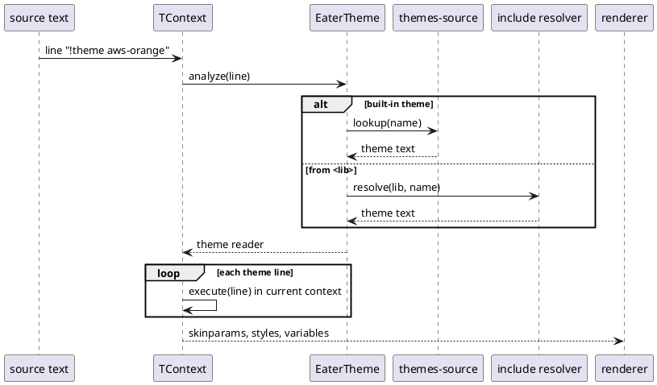
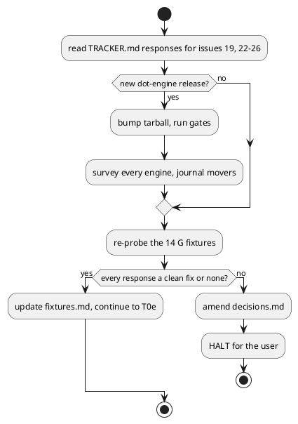

# Data flow — `!theme` execution (after T7a/T7b)

```plantuml
@startuml
participant "source text" as SRC
participant "TContext" as TC
participant "EaterTheme" as ET
participant "themes-source" as TSRC
participant "include resolver" as INC
participant "renderer" as R
SRC -> TC : line "!theme aws-orange"
TC -> ET : analyze(line)
alt built-in theme
  ET -> TSRC : lookup(name)
  TSRC --> ET : theme text
else from <lib>
  ET -> INC : resolve(lib, name)
  INC --> ET : theme text
end
ET --> TC : theme reader
loop each theme line
  TC -> TC : execute(line) in current context
end
TC --> R : skinparams, styles, variables
@enduml
```

# Data flow — dot-engine response gate (T0d)

```plantuml
@startuml
start
:read TRACKER.md responses for issues 19, 22-26;
if (new dot-engine release?) then (yes)
  :bump tarball, run gates;
  :survey every engine, journal movers;
else (no)
endif
:re-probe the 14 G fixtures;
if (every response a clean fix or none?) then (yes)
  :update fixtures.md, continue to T0e;
else (no)
  :amend decisions.md;
  :HALT for the user;
  stop
endif
stop
@enduml
```
