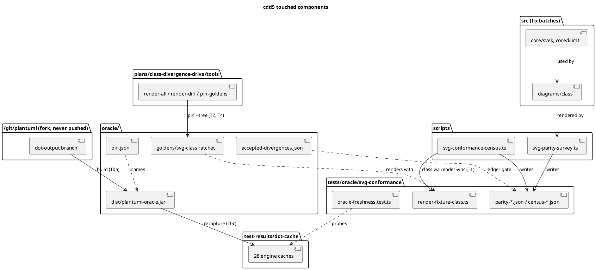

# Component map: what cdd5 touches

```plantuml
@startuml
title cdd5 touched components
package "~/git/plantuml (fork, never pushed)" {
  [dot-output branch] as DO
}
package "oracle/" {
  [pin.json] as PIN
  [dist/plantuml-oracle.jar] as JAR
  [accepted-divergences.json] as ACC
  [goldens/svg-class ratchet] as RAT
}
package "test-results/dot-cache" {
  [28 engine caches] as CACHE
}
package "tests/oracle/svg-conformance" {
  [render-fixture-class.ts] as RFC
  [parity-*.json / census-*.json] as PAR
  [oracle-freshness.test.ts] as FRESH
}
package "scripts" {
  [svg-conformance-census.ts] as CEN
  [svg-parity-survey.ts] as SUR
}
package "plans/class-divergence-drive/tools" {
  [render-all / render-diff / pin-goldens] as TOOLS
}
package "src (fix batches)" {
  [diagrams/class] as CLS
  [core/svek, core/klimt] as CORE
}
DO --> JAR : build (T0a)
PIN ..> JAR : names
JAR --> CACHE : recapture (T0c)
FRESH ..> CACHE : probes
SUR --> PAR : writes
CEN --> PAR : writes
CEN --> RFC : class via renderSync (T1)
TOOLS --> RAT : pin --tree (T2, T4)
RAT ..> RFC : renders with
CLS --> SUR : rendered by
CORE --> CLS : used by
ACC ..> PAR : ledger gate
@enduml
```
