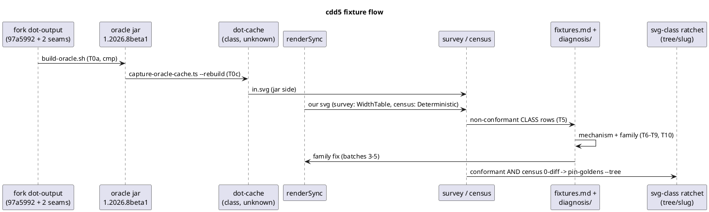

# Data flow: how a fixture moves through cdd5

Re-pin (batch 0), then a class fixture from either tree through measurement,
diagnosis and pinning.

```plantuml
@startuml
title cdd5 fixture flow
participant "fork dot-output\n(97a5992 + 2 seams)" as Fork
participant "oracle jar\n1.2026.8beta1" as Jar
participant "dot-cache\n(class, unknown)" as Cache
participant "renderSync" as Port
participant "survey / census" as Gauge
participant "fixtures.md +\ndiagnosis/" as Ledger
participant "svg-class ratchet\n(tree/slug)" as Ratchet

Fork -> Jar : build-oracle.sh (T0a, cmp)
Jar -> Cache : capture-oracle-cache.ts --rebuild (T0c)
Cache -> Gauge : in.svg (jar side)
Port -> Gauge : our svg (survey: WidthTable, census: Deterministic)
Gauge -> Ledger : non-conformant CLASS rows (T5)
Ledger -> Ledger : mechanism + family (T6-T9, T10)
Ledger -> Port : family fix (batches 3-5)
Gauge -> Ratchet : conformant AND census 0-diff -> pin-goldens --tree
@enduml
```
