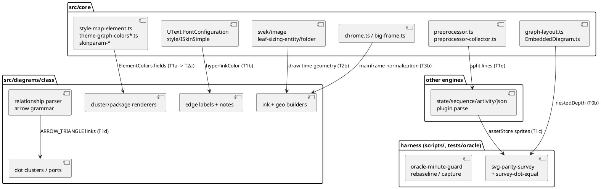

# Component map: what cdd6 touches

```plantuml
@startuml
package "src/core" {
  [preprocessor.ts\npreprocessor-collector.ts] as PRE
  [style-map-element.ts\ntheme-graph-colors*.ts\nskinparam-*] as STY
  [UText FontConfiguration\nstyle/ISkinSimple] as FONT
  [graph-layout.ts\nEmbeddedDiagram.ts] as GL
  [svek/image\nleaf-sizing-entity/folder] as SVEK
  [chrome.ts / big-frame.ts] as CHROME
}
package "src/diagrams/class" {
  [cluster/package renderers] as CLU
  [ink + geo builders] as INK
  [edge labels + notes] as TXT
  [relationship parser\narrow grammar] as REL
  [dot clusters / ports] as DOT
}
package "other engines" {
  [state/sequence/activity/json\nplugin.parse] as OTH
}
package "harness (scripts/, tests/oracle)" {
  [svg-parity-survey\n+ survey-dot-equal] as SURV
  [oracle-minute-guard\nrebaseline / capture] as GUARD
}
STY --> CLU : ElementColors fields (T1a -> T2a)
FONT --> TXT : hyperlinkColor (T1b)
SVEK --> INK : draw-time geometry (T2b)
GL --> SURV : nestedDepth (T0b)
PRE --> OTH : split lines (T1e)
OTH --> SURV : assetStore sprites (T1c)
REL --> DOT : ARROW_TRIANGLE links (T1d)
CHROME --> INK : mainframe normalization (T3b)
@enduml
```
