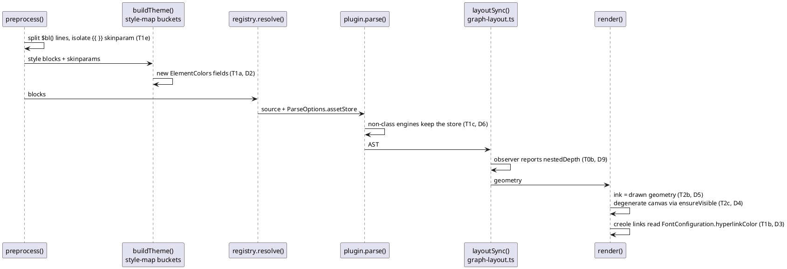
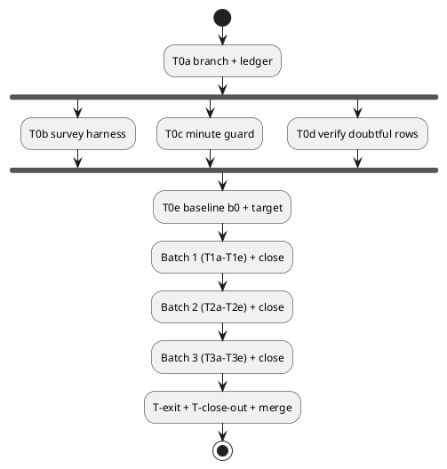

# Data flow: where cdd6 changes the render pipeline

The pipeline is unchanged in shape; cdd6 changes what flows through four seams
(numbered by decision).

```plantuml
@startuml
participant "preprocess()" as Pre
participant "buildTheme()\nstyle-map buckets" as Theme
participant "registry.resolve()" as Reg
participant "plugin.parse()" as Parse
participant "layoutSync()\ngraph-layout.ts" as Layout
participant "render()" as Render

Pre -> Pre : split $bl() lines, isolate {{ }} skinparam (T1e)
Pre -> Theme : style blocks + skinparams
Theme -> Theme : new ElementColors fields (T1a, D2)
Pre -> Reg : blocks
Reg -> Parse : source + ParseOptions.assetStore
Parse -> Parse : non-class engines keep the store (T1c, D6)
Parse -> Layout : AST
Layout -> Layout : observer reports nestedDepth (T0b, D9)
Layout -> Render : geometry
Render -> Render : ink = drawn geometry (T2b, D5)\ndegenerate canvas via ensureVisible (T2c, D4)
Render -> Render : creole links read FontConfiguration.hyperlinkColor (T1b, D3)
@enduml
```

```plantuml
@startuml
start
:T0a branch + ledger;
fork
  :T0b survey harness;
fork again
  :T0c minute guard;
fork again
  :T0d verify doubtful rows;
end fork
:T0e baseline b0 + target;
:Batch 1 (T1a-T1e) + close;
:Batch 2 (T2a-T2e) + close;
:Batch 3 (T3a-T3e) + close;
:T-exit + T-close-out + merge;
stop
@enduml
```
