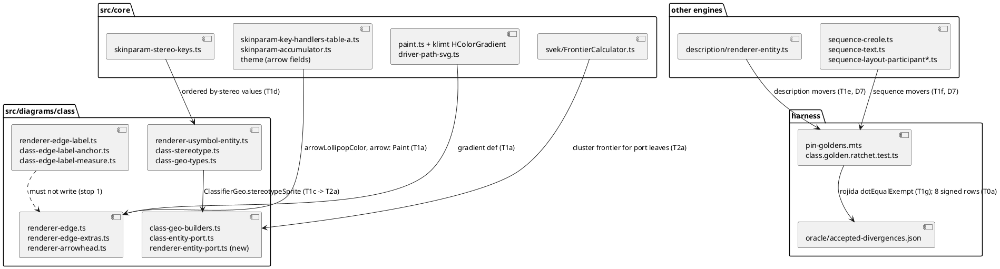

# Component map: what cdd7 touches

```plantuml
@startuml
package "src/core" {
  [skinparam-key-handlers-table-a.ts\nskinparam-accumulator.ts\ntheme (arrow fields)] as SKIN
  [skinparam-stereo-keys.ts] as STEREO
  [paint.ts + klimt HColorGradient\ndriver-path-svg.ts] as PAINT
  [svek/FrontierCalculator.ts] as FRONT
}
package "src/diagrams/class" {
  [renderer-edge.ts\nrenderer-edge-extras.ts\nrenderer-arrowhead.ts] as EDGE
  [renderer-edge-label.ts\nclass-edge-label-anchor.ts\nclass-edge-label-measure.ts] as ELBL
  [renderer-usymbol-entity.ts\nclass-stereotype.ts\nclass-geo-types.ts] as LEAF
  [class-geo-builders.ts\nclass-entity-port.ts\nrenderer-entity-port.ts (new)] as PORT
}
package "other engines" {
  [description/renderer-entity.ts] as DESC
  [sequence-creole.ts\nsequence-text.ts\nsequence-layout-participant*.ts] as SEQ
}
package "harness" {
  [pin-goldens.mts\nclass.golden.ratchet.test.ts] as PIN
  [oracle/accepted-divergences.json] as LEDGER
}
SKIN --> EDGE : arrowLollipopColor, arrow: Paint (T1a)
PAINT --> EDGE : gradient def (T1a)
STEREO --> LEAF : ordered by-stereo values (T1d)
LEAF --> PORT : ClassifierGeo.stereotypeSprite (T1c -> T2a)
FRONT --> PORT : cluster frontier for port leaves (T2a)
ELBL ..> EDGE : must not write (stop 1)
DESC --> PIN : description movers (T1e, D7)
SEQ --> PIN : sequence movers (T1f, D7)
PIN --> LEDGER : rojida dotEqualExempt (T1g); 8 signed rows (T0a)
@enduml
```
