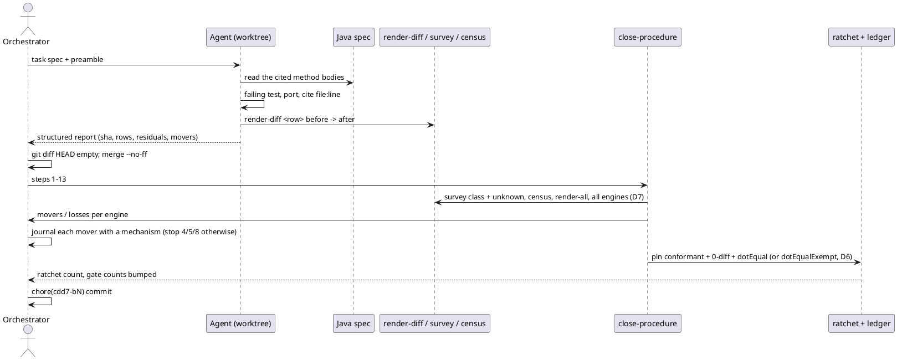
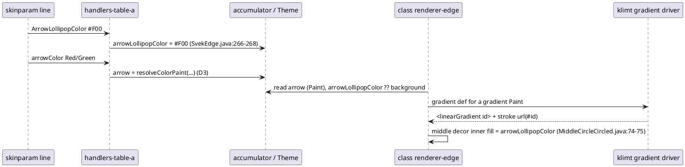

# Data flow: a batch from worktree to pinned golden

```plantuml
@startuml
actor Orchestrator as O
participant "Agent (worktree)" as A
participant "Java spec" as J
participant "render-diff / survey / census" as M
participant "close-procedure" as C
participant "ratchet + ledger" as R

O -> A : task spec + preamble
A -> J : read the cited method bodies
A -> A : failing test, port, cite file:line
A -> M : render-diff <row> before -> after
A --> O : structured report (sha, rows, residuals, movers)
O -> O : git diff HEAD empty; merge --no-ff
O -> C : steps 1-13
C -> M : survey class + unknown, census, render-all, all engines (D7)
C -> O : movers / losses per engine
O -> O : journal each mover with a mechanism (stop 4/5/8 otherwise)
C -> R : pin conformant + 0-diff + dotEqual (or dotEqualExempt, D6)
R --> O : ratchet count, gate counts bumped
O -> O : chore(cdd7-bN) commit
@enduml
```

## Edge paint (T1a) — the one new value path

```plantuml
@startuml
participant "skinparam line" as S
participant "handlers-table-a" as H
participant "accumulator / Theme" as T
participant "class renderer-edge" as E
participant "klimt gradient driver" as G

S -> H : ArrowLollipopColor #F00
H -> T : arrowLollipopColor = #F00 (SvekEdge.java:266-268)
S -> H : arrowColor Red/Green
H -> T : arrow = resolveColorPaint(...) (D3)
E -> T : read arrow (Paint), arrowLollipopColor ?? background
E -> G : gradient def for a gradient Paint
G --> E : <linearGradient id> + stroke url(#id)
E -> E : middle decor inner fill = arrowLollipopColor (MiddleCircleCircled.java:74-75)
@enduml
```
