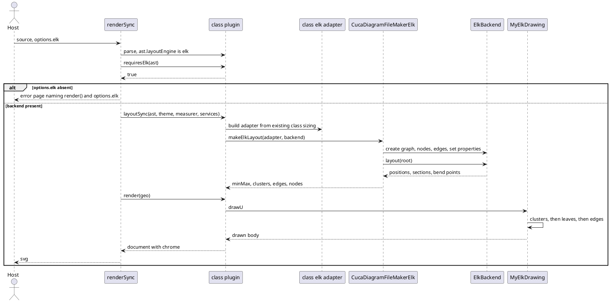

# Data flow: one ELK class diagram through renderSync

`render()` is the same flow, except that it resolves the backend itself (lazy elkjs)
when `options.elk` is absent.

```plantuml
@startuml
actor Host
participant "renderSync" as RS
participant "class plugin" as CP
participant "class elk adapter" as CA
participant "CucaDiagramFileMakerElk" as MK
participant "ElkBackend" as EB
participant "MyElkDrawing" as MD

Host -> RS : source, options.elk
RS -> CP : parse, ast.layoutEngine is elk
RS -> CP : requiresElk(ast)
CP --> RS : true
alt options.elk absent
  RS --> Host : error page naming render() and options.elk
else backend present
  RS -> CP : layoutSync(ast, theme, measurer, services)
  CP -> CA : build adapter from existing class sizing
  CP -> MK : makeElkLayout(adapter, backend)
  MK -> EB : create graph, nodes, edges, set properties
  MK -> EB : layout(root)
  EB --> MK : positions, sections, bend points
  MK --> CP : minMax, clusters, edges, nodes
  RS -> CP : render(geo)
  CP -> MD : drawU
  MD -> MD : clusters, then leaves, then edges
  MD --> CP : drawn body
  CP --> RS : document with chrome
  RS --> Host : svg
end
@enduml
```
