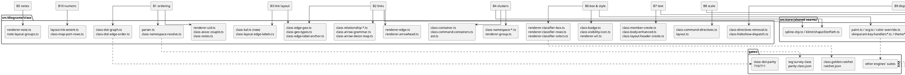

# Component map — which class-engine modules each batch touches

Arrows read "batch writes module". Shared `src/core` seams are the
bottom row; the four gates are on the right.

```plantuml
@startuml
skinparam componentStyle rectangle
skinparam linetype ortho

package "src/diagrams/class" {
  [parser.ts\nclass-namespace-resolve.ts] as parse
  [class-dot-graph.ts\nclass-dot-edge-order.ts] as dotgraph
  [renderer-uid.ts\nclass-assoc-couple.ts\nclass-notes.ts] as uid
  [class-relationship-*.ts\nclass-arrow-grammar.ts\nclass-arrow-decor-map.ts] as relast
  [class-edge-geo.ts\nclass-geo-types.ts\nclass-edge-label-anchor.ts] as edgegeo
  [renderer-edge.ts\nrenderer-arrowhead.ts] as edgerender
  [renderer-note.ts\nnote-layout-groups.ts] as notes
  [class-container.ts\nclass-command-containers.ts\nast.ts] as containers
  [class-namespace-*.ts\nrenderer-group.ts] as clusters
  [class-kal.ts (new)\nclass-layout-edge-labels.ts] as kal
  [renderer-classifier-box.ts\nrenderer-classifier-rows.ts\nrenderer-classifier-colors.ts] as box
  [class-badge.ts\nclass-visibility-icon.ts\nrenderer-url.ts] as badge
  [class-member-creole.ts\nclass-body-enhanced.ts\nclass-layout-header-creole.ts] as text
  [class-command-directives.ts\nlayout.ts] as directives
  [class-directives-removal.ts\nclass-hideshow-dispatch.ts] as hide
  [layout-ink-extent.ts\nclass-map-port-rows.ts] as numeric
}

package "src/core (shared seams)" {
  [paint.ts / svg.ts / color-override.ts\nskinparam-key-handlers*.ts / theme*.ts] as paint
  [klimt/creole/* / EmbeddedDiagram.ts\nannotations/blocks.ts] as creole
  [scale-command.ts] as scale
  [dispatcher.ts / error/*\nklimt/document-shell.ts / url/UrlBuilder.ts] as dispatch
  [spline-clip.ts / klimt/shape/DotPath.ts] as geom
}

package "gates" {
  [svg:survey class\nparity-class.json] as survey
  [class.golden.ratchet\nratchet.json] as ratchet
  [class-dot-parity\n710/711] as dot
  [other engines' suites] as others
}

[B1 ordering] --> parse
[B1 ordering] --> dotgraph
[B1 ordering] --> uid
[B2 links] --> relast
[B2 links] --> edgegeo
[B2 links] --> edgerender
[B2 links] --> geom
[B3 link layout] --> kal
[B3 link layout] --> edgegeo
[B4 clusters] --> containers
[B4 clusters] --> clusters
[B4 clusters] --> geom
[B5 notes] --> notes
[B6 box & style] --> box
[B6 box & style] --> badge
[B6 box & style] --> paint
[B7 text] --> text
[B7 text] --> creole
[B8 scale] --> directives
[B8 scale] --> scale
[B9 dispatch] --> hide
[B9 dispatch] --> dispatch
[B10 numeric] --> numeric

parse ..> survey
dotgraph ..> dot
paint ..> others
creole ..> others
scale ..> others
dispatch ..> others
box ..> ratchet
@enduml
```
