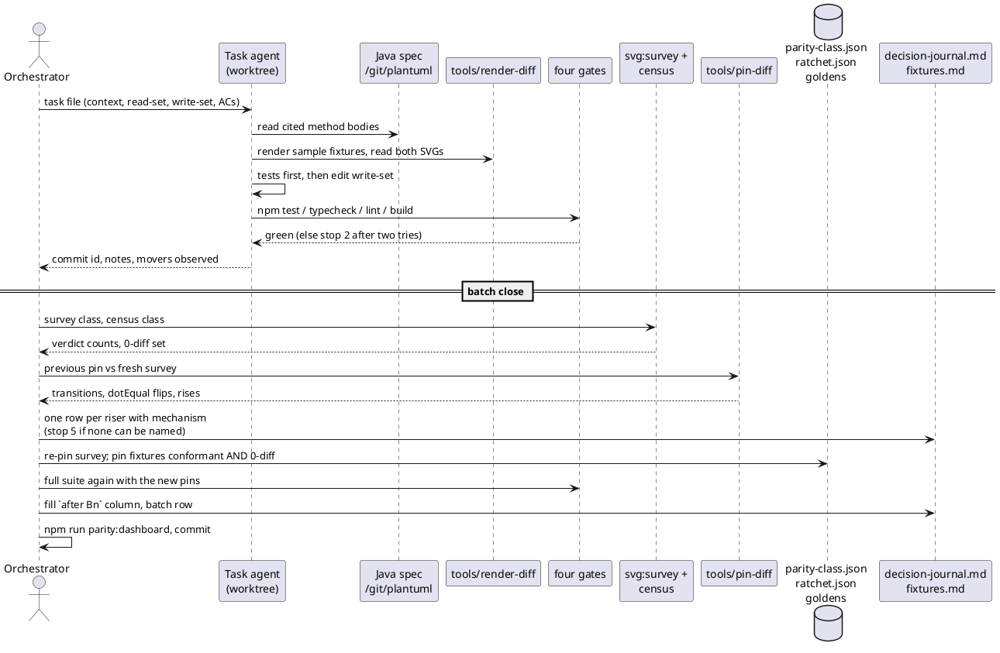
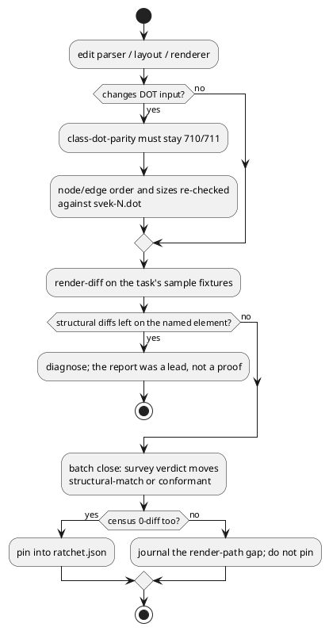

# Data flow — a batch from first task to close

The same loop runs for every batch. The only variable is which modules the
batch's tasks edit (see `component-map.md`).

## Where a mechanism's fix becomes visible

