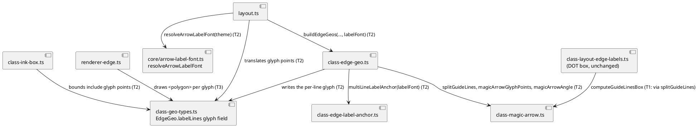

# Component map — class edge-label ink path

```plantuml
@startuml
component [class-magic-arrow.ts] as MA
component [class-edge-geo.ts] as GEO
component [class-edge-label-anchor.ts] as ANCHOR
component "class-geo-types.ts\nEdgeGeo.labelLines glyph field" as TYPES
component [layout.ts] as LAYOUT
component [class-ink-box.ts] as INK
component [renderer-edge.ts] as REND
component "core/arrow-label-font.ts\nresolveArrowLabelFont" as FONT
component "class-layout-edge-labels.ts\n(DOT box, unchanged)" as DOT

DOT --> MA : computeGuideLinesBox (T1: via splitGuideLines)
GEO --> MA : splitGuideLines, magicArrowGlyphPoints, magicArrowAngle (T2)
GEO --> ANCHOR : multiLineLabelAnchor(labelFont) (T2)
GEO --> TYPES : writes the per-line glyph (T2)
LAYOUT --> FONT : resolveArrowLabelFont(theme) (T2)
LAYOUT --> GEO : buildEdgeGeos(..., labelFont) (T2)
LAYOUT --> TYPES : translates glyph points (T2)
INK --> TYPES : bounds include glyph points (T2)
REND --> TYPES : draws <polygon> per glyph (T3)
@enduml
```
