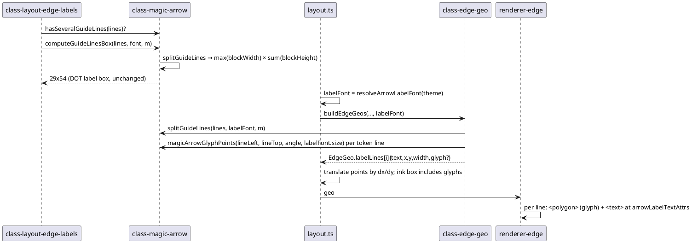

# Data flow — a multi-line guide-line label from source to SVG

```plantuml
@startuml
participant "class-layout-edge-labels" as DOT
participant "class-magic-arrow" as MA
participant "layout.ts" as L
participant "class-edge-geo" as G
participant "renderer-edge" as R

DOT -> MA : hasSeveralGuideLines(lines)?
DOT -> MA : computeGuideLinesBox(lines, font, m)
MA -> MA : splitGuideLines → max(blockWidth) × sum(blockHeight)
MA --> DOT : 29x54 (DOT label box, unchanged)
L -> L : labelFont = resolveArrowLabelFont(theme)
L -> G : buildEdgeGeos(..., labelFont)
G -> MA : splitGuideLines(lines, labelFont, m)
G -> MA : magicArrowGlyphPoints(lineLeft, lineTop, angle, labelFont.size) per token line
G --> L : EdgeGeo.labelLines[i]{text,x,y,width,glyph?}
L -> L : translate points by dx/dy; ink box includes glyphs
L -> R : geo
R -> R : per line: <polygon> (glyph) + <text> at arrowLabelTextAttrs
@enduml
```
