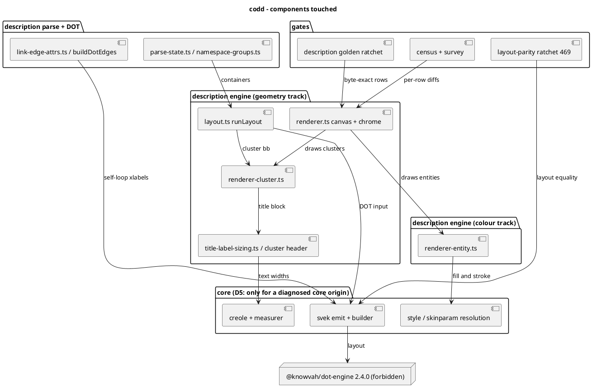

# Component map

Which components codd touches and how they relate. Core is edited only for a diagnosed core origin (D5); dot-engine is forbidden. Rendered with the oracle jar on 2026-10-15.

```plantuml
@startuml
title codd - components touched
package "description engine (geometry track)" {
  [layout.ts runLayout] as RL
  [renderer-cluster.ts] as RC
  [renderer.ts canvas + chrome] as RR
  [title-label-sizing.ts / cluster header] as TH
}
package "description engine (colour track)" {
  [renderer-entity.ts] as RE
}
package "description parse + DOT" {
  [parse-state.ts / namespace-groups.ts] as PS
  [link-edge-attrs.ts / buildDotEdges] as LE
}
package "core (D5: only for a diagnosed core origin)" {
  [style / skinparam resolution] as ST
  [creole + measurer] as CR
  [svek emit + builder] as SV
}
package "gates" {
  [description golden ratchet] as DR
  [layout-parity ratchet 469] as LPR
  [census + survey] as CEN
}
node "@knowvah/dot-engine 2.4.0 (forbidden)" as DE
PS --> RL : containers
LE --> SV : self-loop xlabels
RL --> SV : DOT input
SV --> DE : layout
RL --> RC : cluster bb
RC --> TH : title block
RR --> RC : draws clusters
RR --> RE : draws entities
RE --> ST : fill and stroke
TH --> CR : text widths
DR --> RR : byte-exact rows
LPR --> SV : layout equality
CEN --> RR : per-row diffs
@enduml
```
