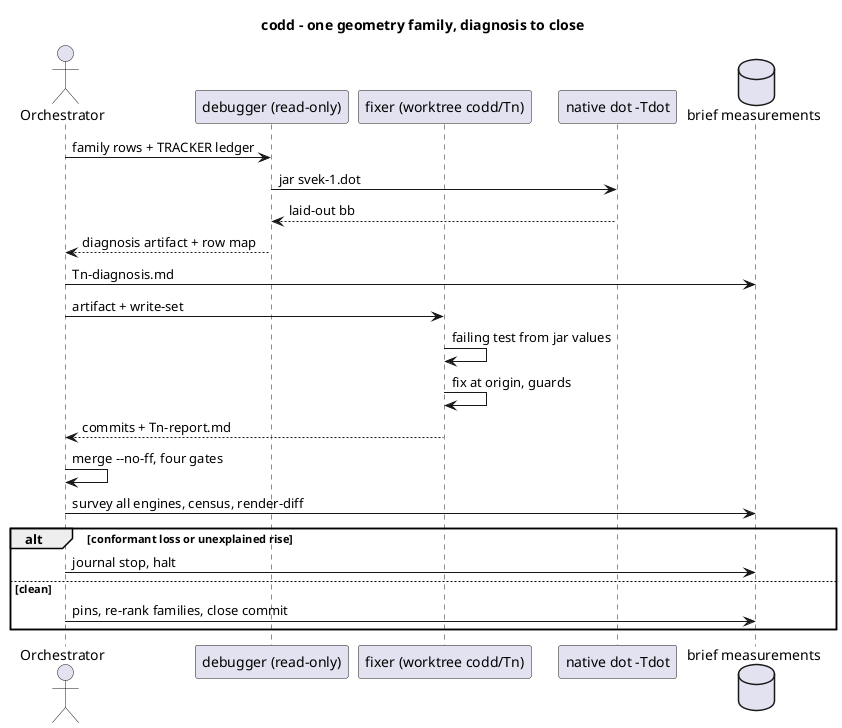

# Data flow

One geometry family from diagnosis to close (D6, D8, close procedure). Colour singletons skip the debugger step. Rendered with the oracle jar on 2026-10-15.

```plantuml
@startuml
title codd - one geometry family, diagnosis to close
actor Orchestrator as O
participant "debugger (read-only)" as D
participant "fixer (worktree codd/Tn)" as F
participant "native dot -Tdot" as N
database "brief measurements" as M
O -> D : family rows + TRACKER ledger
D -> N : jar svek-1.dot
N --> D : laid-out bb
D --> O : diagnosis artifact + row map
O -> M : Tn-diagnosis.md
O -> F : artifact + write-set
F -> F : failing test from jar values
F -> F : fix at origin, guards
F --> O : commits + Tn-report.md
O -> O : merge --no-ff, four gates
O -> M : survey all engines, census, render-diff
alt conformant loss or unexplained rise
  O -> M : journal stop, halt
else clean
  O -> M : pins, re-rank families, close commit
end
@enduml
```
