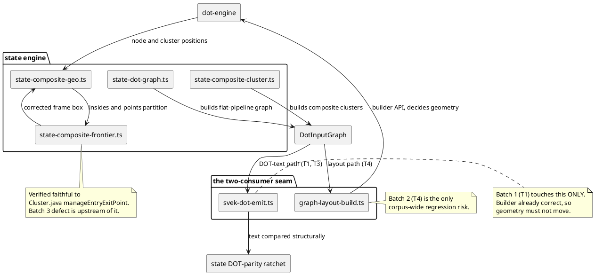

# Component map — what this mission touches

One `DotInputGraph` feeds **two independent consumers**. Four defects in this
area were divergences between them, in both directions. Batch 1 changes only the
emitter; batch 2 must change both together.

