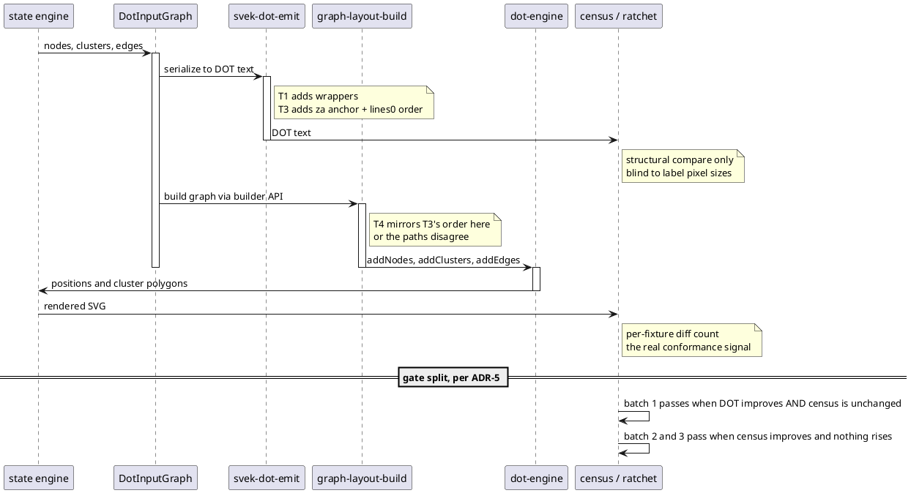

# Data flow — where each batch intervenes

The two consumers never compare notes; only the gates do, and each gate is blind
to part of the picture. That asymmetry is what ADR-5 splits.

```plantuml
@startuml
participant "state engine" as SE
participant "DotInputGraph" as DIG
participant "svek-dot-emit" as EMIT
participant "graph-layout-build" as BUILD
participant "dot-engine" as ENG
participant "census / ratchet" as GATE

SE -> DIG : nodes, clusters, edges
activate DIG

DIG -> EMIT : serialize to DOT text
activate EMIT
note right of EMIT : T1 adds wrappers\nT3 adds za anchor + lines0 order
EMIT -> GATE : DOT text
note right of GATE : structural compare only\nblind to label pixel sizes
deactivate EMIT

DIG -> BUILD : build graph via builder API
activate BUILD
note right of BUILD : T4 mirrors T3's order here\nor the paths disagree
BUILD -> ENG : addNodes, addClusters, addEdges
deactivate BUILD
deactivate DIG

activate ENG
ENG -> SE : positions and cluster polygons
deactivate ENG

SE -> GATE : rendered SVG
note right of GATE : per-fixture diff count\nthe real conformance signal

== gate split, per ADR-5 ==
GATE -> GATE : batch 1 passes when DOT improves AND census is unchanged
GATE -> GATE : batch 2 and 3 pass when census improves and nothing rises
@enduml
```
