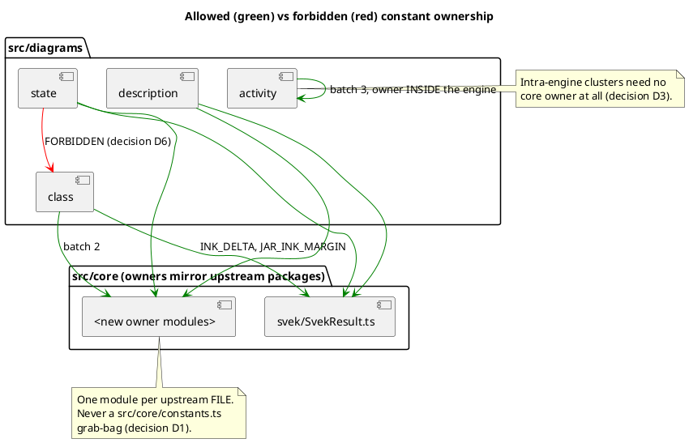
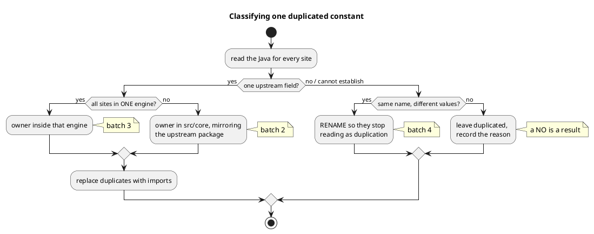

# Where owners live, and where they must not

The rule is D1: an owner module mirrors the upstream package and file that
declares the field. D6 forbids the shortcut of one engine importing from
another.

## The three outcomes a duplicate can have

