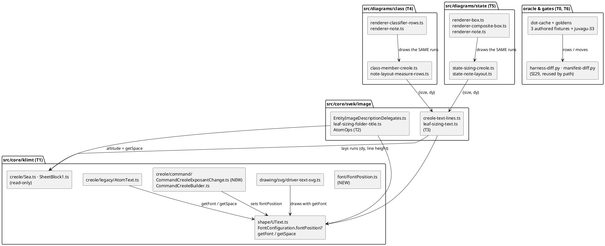

# Component map — what SI30 touches

```plantuml
@startuml
skinparam componentStyle rectangle
package "src/core/klimt (T1)" {
  [font/FontPosition.ts\n(NEW)] as fp
  [shape/UText.ts\nFontConfiguration.fontPosition?\ngetFont / getSpace] as ut
  [creole/command/\nCommandCreoleExposantChange.ts (NEW)\nCommandCreoleBuilder.ts] as cmd
  [creole/legacy/AtomText.ts] as at
  [drawing/svg/driver-text-svg.ts] as drv
  [creole/Sea.ts · SheetBlock1.ts\n(read-only)] as sea
}
package "src/core/svek/image" {
  [EntityImageDescriptionDelegates.ts\nleaf-sizing-folder-title.ts\nAtomOps (T2)] as ops
  [creole-text-lines.ts\nleaf-sizing-text.ts\n(T3)] as seam
}
package "src/diagrams/class (T4)" {
  [class-member-creole.ts\nnote-layout-measure-rows.ts] as csize
  [renderer-classifier-rows.ts\nrenderer-note.ts] as cdraw
}
package "src/diagrams/state (T5)" {
  [state-sizing-creole.ts\nstate-note-layout.ts] as ssize
  [renderer-box.ts\nrenderer-composite-box.ts\nrenderer-note.ts] as sdraw
}
package "oracle & gates (T0, T6)" {
  [dot-cache + goldens\n3 authored fixtures + juvagu-33] as fx
  [harness-diff.py · manifest-diff.py\n(SI29, reused by path)] as gates
}
cmd --> ut : sets fontPosition
at --> ut : getFont / getSpace
drv --> ut : draws with getFont
ops --> sea : altitude = getSpace
ops --> ut
seam --> sea : lays runs (dy, line height)
seam --> ut
csize --> seam : {size, dy}
cdraw --> csize : draws the SAME runs
ssize --> seam : {size, dy}
sdraw --> ssize : draws the SAME runs
fx --> gates : rows / moves
@enduml
```
