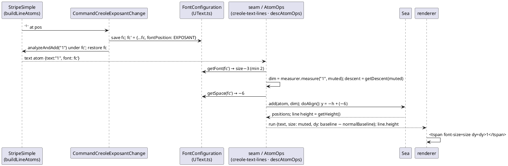

# Data flow — one `` run from source to SVG (post-mission)

Java lines: `CommandCreoleExposantChange.java:81-95`, `FontConfiguration.java:
98-104,370-372`, `FontPosition.java:41-60`, `Sea.java:60-80`,
`AtomText.java:175-193,213-215,321-323`.
