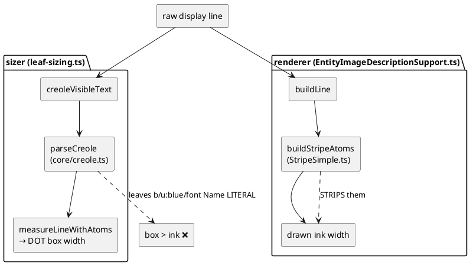
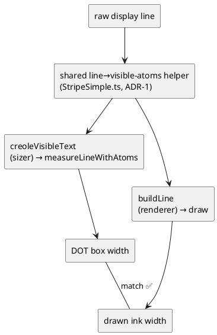
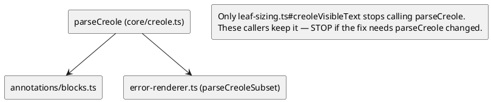

# Component map — two lexers → one

## Today (the bug): two independent creole lexers

```plantuml
@startuml
skinparam componentStyle rectangle
skinparam shadowing false

package "sizer (leaf-sizing.ts)" {
  [creoleVisibleText] as cvt
  [parseCreole\n(core/creole.ts)] as pc
  [measureLineWithAtoms\n→ DOT box width] as mlw
}

package "renderer (EntityImageDescriptionSupport.ts)" {
  [buildLine] as bl
  [buildStripeAtoms\n(StripeSimple.ts)] as bsa
  [drawn ink width] as draw
}

[raw display line] as raw
[box > ink ❌] as bad

cvt --> pc
pc --> mlw
bl --> bsa
bsa --> draw
raw --> cvt
raw --> bl
pc ..> bad : leaves b/u:blue/font Name LITERAL
bsa ..> draw : STRIPS them
@enduml
```

## After (T2): one shared helper, both paths agree

```plantuml
@startuml
skinparam componentStyle rectangle
skinparam shadowing false

[raw display line] as raw
[shared line→visible-atoms helper\n(StripeSimple.ts, ADR-1)] as helper
[creoleVisibleText\n(sizer) → measureLineWithAtoms] as cvt
[buildLine\n(renderer) → draw] as bl
[DOT box width] as box
[drawn ink width] as ink

raw --> helper
helper --> cvt
helper --> bl
cvt --> box
bl --> ink
box -- ink : match ✅
@enduml
```

## Untouched (do not disturb)

```plantuml
@startuml
skinparam componentStyle rectangle
skinparam shadowing false

[parseCreole (core/creole.ts)] as pc
[annotations/blocks.ts] as ann
[error-renderer.ts (parseCreoleSubset)] as err
[Only leaf-sizing.ts#creoleVisibleText stops calling parseCreole.\nThese callers keep it — STOP if the fix needs parseCreole changed.] as note

pc --> ann
pc --> err
@enduml
```
