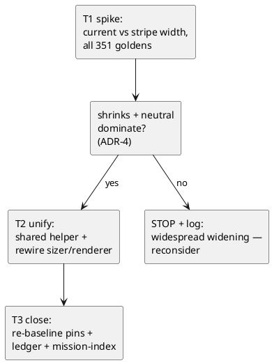
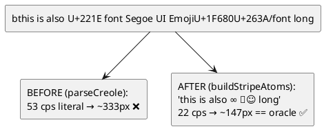

# Data flow — spike-gated unification

## Execution sequence (T1 gates T2 gates T3)

```plantuml
@startuml
skinparam componentStyle rectangle
skinparam shadowing false

[T1 spike:\ncurrent vs stripe width,\nall 351 goldens] as T1
[shrinks + neutral\ndominate?\n(ADR-4)] as gate
[T2 unify:\nshared helper +\nrewire sizer/renderer] as T2
[T3 close:\nre-baseline pins +\nledger + mission-index] as T3
[STOP + log:\nwidespread widening —\nreconsider] as stop

T1 --> gate
gate --> T2 : yes
T2 --> T3
gate --> stop : no
@enduml
```

## Per-line width, before vs after (node `bar`)

```plantuml
@startuml
skinparam componentStyle rectangle
skinparam shadowing false

[bthis is also U+221E font Segoe UI EmojiU+1F680U+263A/font long] as raw
[BEFORE (parseCreole):\n53 cps literal → ~333px ❌] as before
[AFTER (buildStripeAtoms):\n'this is also ∞ 🚀☺ long'\n22 cps → ~147px == oracle ✅] as after

raw --> before
raw --> after
@enduml
```
