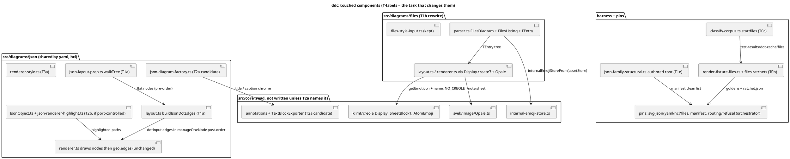

# Component map — what ddc touches

```plantuml
@startuml
title ddc: touched components (T-labels = the task that changes them)
package "src/diagrams/json (shared by yaml, hcl)" {
  [json-layout-prep.ts walkTree (T1a)] as Walk
  [layout.ts buildJsonDotEdges (T1a)] as Edges
  [renderer.ts draws nodes then geo.edges (unchanged)] as JR
  [JsonObject.ts + json-renderer-highlight.ts (T2b, if port-controlled)] as HL
  [json-diagram-factory.ts (T2a candidate)] as JF
  [renderer-style.ts (T3a)] as JS
}
package "src/diagrams/files (T1b rewrite)" {
  [parser.ts FilesDiagram + FilesListing + FEntry] as FP
  [layout.ts / renderer.ts via Display.create7 + Opale] as FR
  [files-style-input.ts (kept)] as FS
}
package "src/core (read, not written unless T2a names it)" {
  [klimt/creole Display, SheetBlock1, AtomEmoji] as Creole
  [svek/image/Opale.ts] as Opale
  [internal-emoji-store.ts] as Emoji
  [annotations + TextBlockExporter (T2a candidate)] as Chrome
}
package "harness + pins" {
  [classify-corpus.ts startfiles (T0c)] as Cls
  [render-fixture-files.ts + files ratchets (T0b)] as FH
  [json-family-structural.ts authored root (T1e)] as SG
  [pins: svg-json/yaml/hcl/files, manifest, routing/refusal (orchestrator)] as Pins
}
Walk --> Edges : flat nodes (pre-order)
Edges --> JR : dotInput.edges in manageOneNode post-order
HL --> JR : highlighted paths
FP --> FR : FEntry tree
FR --> Creole : getEmoticon + name, NO_CREOLE
FR --> Opale : note sheet
FP --> Emoji : internalEmojiStoreFrom(assetStore)
JF --> Chrome : title / caption chrome
Cls --> FH : test-results/dot-cache/files
FH --> Pins : goldens + ratchet.json
SG --> Pins : manifest clean list
@enduml
```
