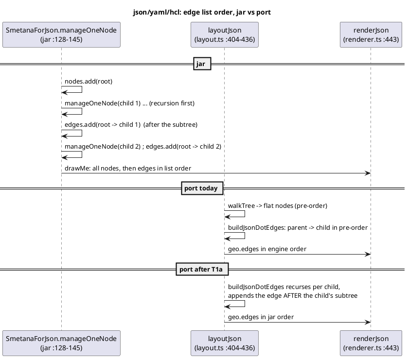
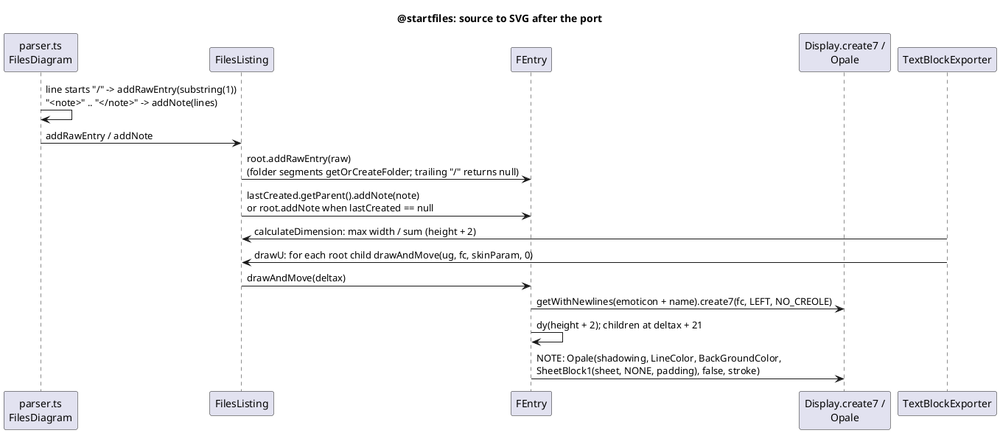

# Data flow — the two mechanisms this drive changes

## Edge emission order (D2, T1a)

```plantuml
@startuml
title json/yaml/hcl: edge list order, jar vs port
participant "SmetanaForJson.manageOneNode\n(jar :128-145)" as J
participant "layoutJson\n(layout.ts :404-436)" as L
participant "renderJson\n(renderer.ts :443)" as R
== jar ==
J -> J : nodes.add(root)
J -> J : manageOneNode(child 1) ... (recursion first)
J -> J : edges.add(root -> child 1)  (after the subtree)
J -> J : manageOneNode(child 2) ; edges.add(root -> child 2)
J -> R : drawMe: all nodes, then edges in list order
== port today ==
L -> L : walkTree -> flat nodes (pre-order)
L -> L : buildJsonDotEdges: parent -> child in pre-order
L -> R : geo.edges in engine order
== port after T1a ==
L -> L : buildJsonDotEdges recurses per child,\nappends the edge AFTER the child's subtree
L -> R : geo.edges in jar order
@enduml
```

## files render (D3, T1b)

```plantuml
@startuml
title @startfiles: source to SVG after the port
participant "parser.ts\nFilesDiagram" as P
participant "FilesListing" as FL
participant "FEntry" as FE
participant "Display.create7 /\nOpale" as K
participant "TextBlockExporter" as X
P -> P : line starts "/" -> addRawEntry(substring(1))\n"<note>" .. "</note>" -> addNote(lines)
P -> FL : addRawEntry / addNote
FL -> FE : root.addRawEntry(raw)\n(folder segments getOrCreateFolder; trailing "/" returns null)
FL -> FE : lastCreated.getParent().addNote(note)\nor root.addNote when lastCreated == null
X -> FL : calculateDimension: max width / sum (height + 2)
X -> FL : drawU: for each root child drawAndMove(ug, fc, skinParam, 0)
FL -> FE : drawAndMove(deltax)
FE -> K : getWithNewlines(emoticon + name).create7(fc, LEFT, NO_CREOLE)
FE -> FE : dy(height + 2); children at deltax + 21
FE -> K : NOTE: Opale(shadowing, LineColor, BackGroundColor,\nSheetBlock1(sheet, NONE, padding), false, stroke)
@enduml
```
