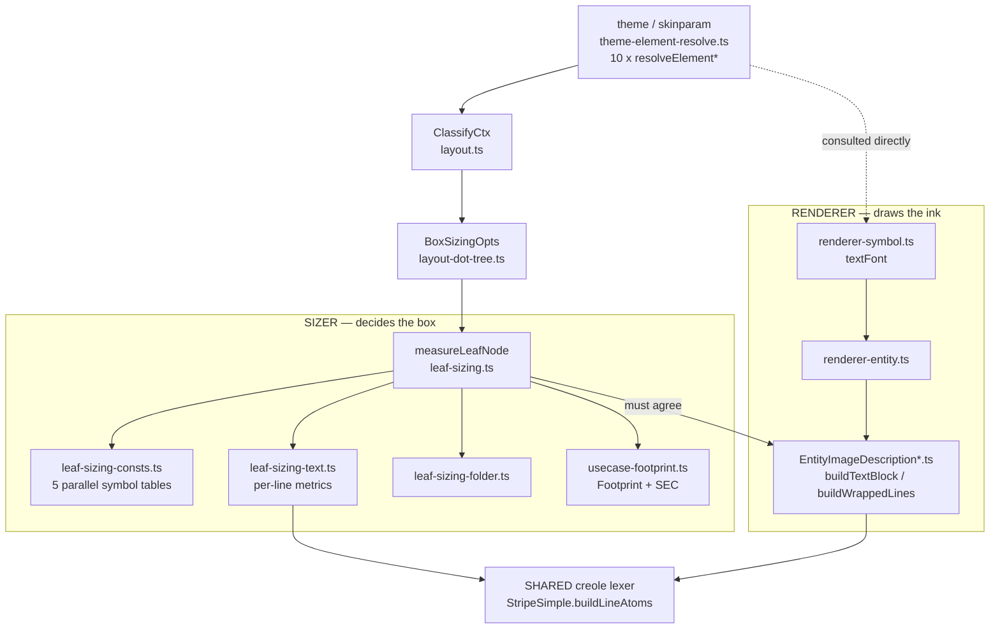

# Component map — where sizing decisions are made

The mission's whole subject is the **left/right split** below: two paths
that must agree on geometry but are wired independently. Every instance of
the recurring bug is a setting that reached the right path and not the left.

## Reading it

- `ClassifyCtx` → `BoxSizingOpts` is the ONLY channel by which a
  per-diagram or per-element setting reaches the sizer. If a setting is
  not in that chain, the sizer cannot see it — that is the bug class.
- The renderer reads `theme` directly (dotted edge), which is why it
  routinely gets a feature first.
- `buildLineAtoms` is the one component both sides already share; making
  more geometry flow through shared components (as the use-case point fit
  and the guillemet pass now do) is what structurally prevents drift.
