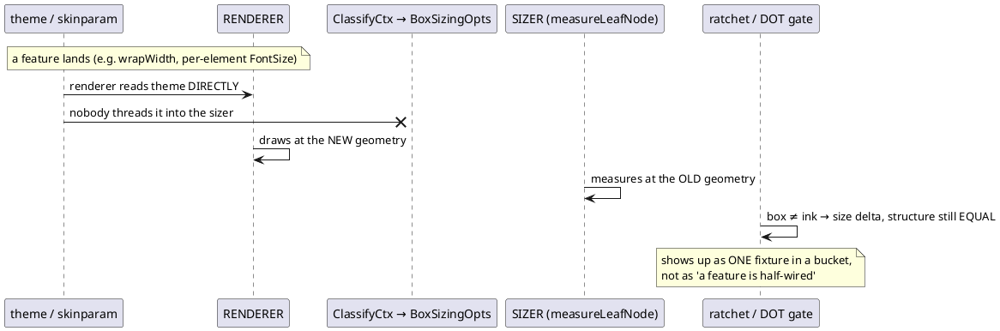
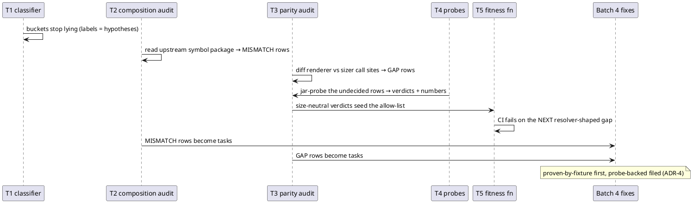
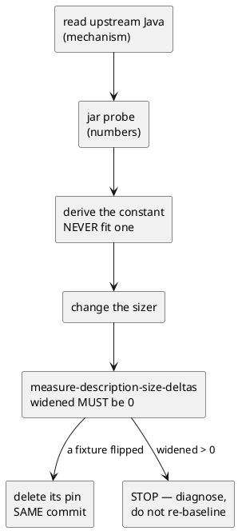

# Data flow — how a size gap appears, and how the audit closes it

## 1. How the recurring bug arises

That last note is the trap: the failure surfaces as a single mis-sized
fixture in whatever bucket the classifier guessed, so it gets fixed one
fixture at a time instead of once at the seam.

## 2. How this mission closes it

## 3. The verification loop each Batch-4 task runs

